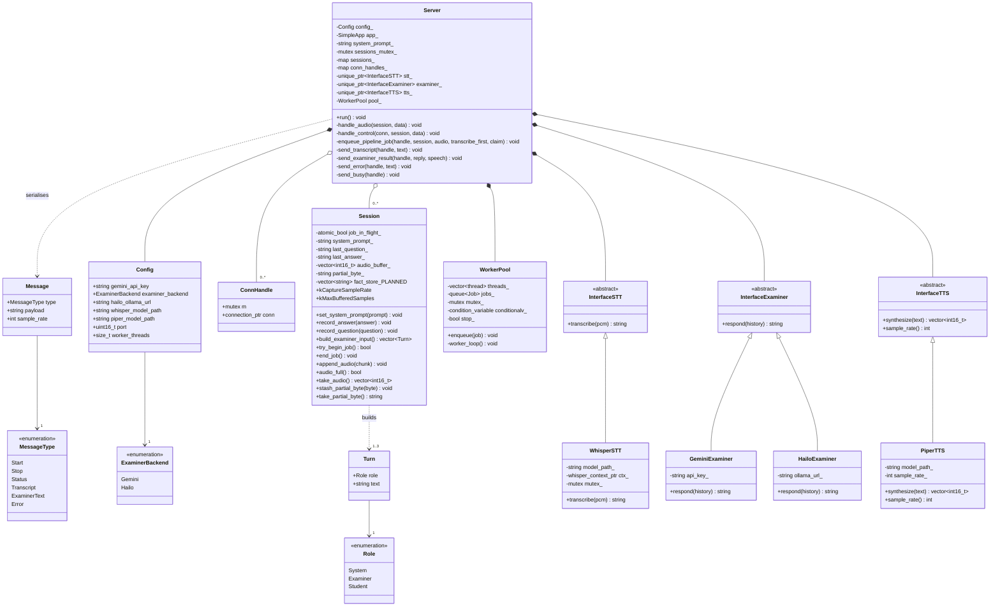
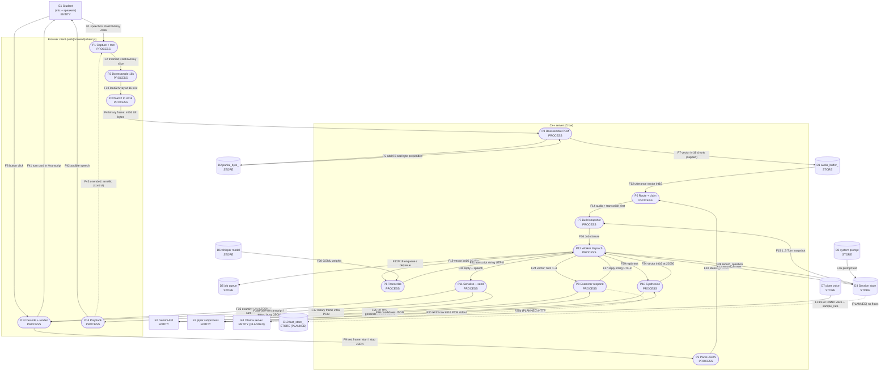
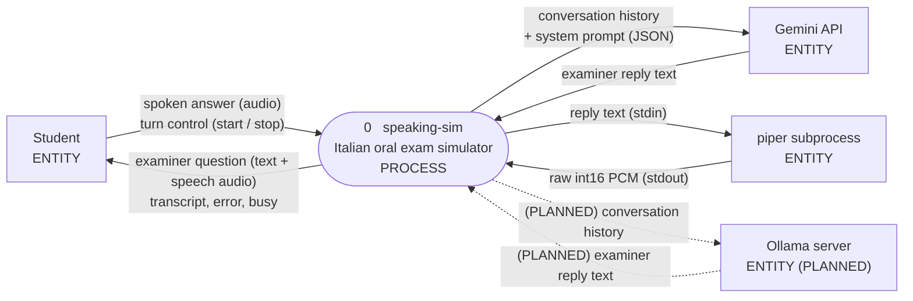

# speaking-sim — system model

A technical model of `speaking-sim`: what the classes are, how a turn flows
through the server, what is stored, and where the decisions are made. Written
to be read alongside the code rather than instead of it, so elements carry a
`file:line` citation into the `speaking-sim/` tree. Paths are relative to
`speaking-sim/`.

**Scope.** `speaking-sim/` only. The separate Italian revision web app is out of
scope and is not referenced anywhere in this document.

**State tags.** Every element is tagged:

- `[IMPLEMENTED]` — code exists and runs on the current path.
- `[PLANNED]` — named in the design but with no working code, or a deliberate stub.

> **How current this is.** Section 0 below was regenerated against the tree and
> is accurate. **Sections 1 to 6 and the supplementary sections were written
> against a much earlier version of this project** — one with no accounts, no
> classes, no database and a single-page browser client — and their line numbers
> no longer point where they say. Their description of the audio pipeline still
> holds in outline, because that part has changed least; everything they say
> about storage, the browser client or the page count does not. Read them as
> history until they are redone, and trust section 0 and the READMEs for the
> current shape.

---

## 0. Repository inventory

Every tracked file this project wrote, by area, with its current line count.
Excluded: `build/`, the vendored submodule sources under `third_party/`
(`whisper.cpp`, `piper`), model weights under `models/`, the binary fonts, and
`web(frontend)/vendor/htmx.esm.js` — all upstream code or assets rather than
this system.

**Entry, configuration and build**

| File | Lines | Role |
| --- | --- | --- |
| `src/main.cpp` | 372 | Entry point; builds config, backends and `Server`, and carries the command-line tools (licences, retention, exports, the tense and audio self-checks) |
| `src/config.cpp` | 522 | Reads and validates every env var into `Config` |
| `include/sim/config.hpp` | 178 | `Config` and the enums it holds |
| `CMakeLists.txt` | 399 | Build; FetchContent for Crow, Asio, cpp-httplib and SQLite; feature gates for whisper and piper; the two test targets |
| `.env.example` | 298 | Documented defaults for every setting |
| `run.ps1` | 102 | Loads `.env` and starts the binary on Windows |

**The server and one exam**

| File | Lines | Role |
| --- | --- | --- |
| `src/server.cpp` | 2267 | Crow routes, the WebSocket, audio framing, the turn pipeline, auth and retention |
| `include/sim/server.hpp` | 372 | `ConnHandle`, `Server` and its handler declarations |
| `src/session.cpp` | 847 | Per-connection audio buffer, conversation state, and how a plan is followed |
| `include/sim/session.hpp` | 297 | `Session` |
| `src/protocol.cpp` | 132 | `Message` ↔ JSON |
| `src/worker.cpp` | 93 | Thread pool: queue, condition variable, exception backstop |
| `src/audio_encode.cpp` | 184 | PCM to FLAC or WAV for the examiner call |
| `src/http_util.cpp` | 107 | `json_response`, `html_fragment`, `guarded`, cookie and origin checks |

**JSON API and rendered fragments**

| File | Lines | Role |
| --- | --- | --- |
| `src/class_api.cpp` | 1442 | Classes, members, invites, exam history; the JSON routes and their `/teacher` and `/me` fragment twins |
| `src/plan_api.cpp` | 549 | Exam plans, exam options, the class coverage report |
| `src/plan_json.cpp` | 236 | Plan ↔ JSON, with validation |
| `src/views.cpp` | 121 | The labels a page shows: dates, end reasons, lengths, join codes |
| `src/static_files.cpp` | 192 | Whole-file and Range reads, and the name allowlists the URL-fed routes use |

**Storage**

| File | Lines | Role |
| --- | --- | --- |
| `src/store.cpp` | 2369 | SQLite: schema, accounts, classes, plans, attempts, turns, features, licences, usage, retention |
| `include/sim/store.hpp` | 521 | The row structs and the `Store` interface |

**Safety**

| File | Lines | Role |
| --- | --- | --- |
| `src/safety/wordlist_safety.cpp` | 349 | Offline word-list screening in both directions |
| `src/safety/safety_chain.cpp` | 225 | Orders the detectors and decides what a verdict means |
| `src/safety/semantic_adjudicator.cpp` | 201 | A reasoning pass over the filters' own triggers |
| `src/safety/azure_safety.cpp` | 201 | Content-safety HTTP client |
| `src/safety/examiner_adjudicator.cpp` | 165 | The examiner model as a second opinion |

**Language, exams and text**

| File | Lines | Role |
| --- | --- | --- |
| `src/language.cpp` | 251 | The language packs and the registry that holds them |
| `src/tense_rules.cpp` | 357 | Deterministic tense detection for Italian and German |
| `src/question_bank.cpp` | 156 | Reads and groups each language's question bank |
| `src/topics.cpp` | 136 | The syllabus topic groups and the tags that fold into them |
| `src/text_clean.cpp` | 150 | Trimming and normalising what the model and the student send |
| `src/translate.cpp` | 139 | The translate box's backend |
| `src/rate_limit.cpp` | 50 | Per-caller token buckets |

**Pluggable backends**

| File | Lines | Role |
| --- | --- | --- |
| `src/examiner/gemini_examiner.cpp` | 556 | Gemini `generateContent` over HTTPS, with the structured reply schema |
| `src/tts/piper_tts.cpp` | 270 | piper as a subprocess (POSIX `fork`/`exec`, Win32 `CreateProcess`) |
| `src/stt/whisper_stt.cpp` | 118 | whisper.cpp inference |
| `src/examiner/hailo_examiner.cpp` | 22 | Stub: returns a placeholder string |
| `src/auth/google_oauth.cpp` | 306 | The Google sign-in exchange |

**Browser client**

| File | Lines | Role |
| --- | --- | --- |
| `web(frontend)/client.js` | 1572 | The exam page: mic capture, resampling, the WebSocket, playback, the transcript and the .docx export |
| `web(frontend)/account.js` | 999 | The sign-in gate, the sign-up steps and the settings modal |
| `web(frontend)/teacher.js` | 728 | The dashboard: its hash router, the exam plan editor, and the requests that fill the rendered cards |
| `web(frontend)/listening.js` | 506 | The listening papers |
| `web(frontend)/classes.js` | 344 | The exam page's class and plan pickers |
| `web(frontend)/translate.js` | 175 | The quick-translate box, shared by two pages |
| `web(frontend)/classes-page.js` | 124 | The student's own classes page |
| `web(frontend)/api.js` | 51 | One reader for every `/api` route |

**Pages, templates and styles**

| File | Lines | Role |
| --- | --- | --- |
| `web(frontend)/index.html` | 184 | The exam page |
| `web(frontend)/teacher.html` | 215 | The dashboard |
| `web(frontend)/listening.html` | 74 | The listening page |
| `web(frontend)/classes-page.html` | 76 | The student's classes page |
| `web(frontend)/templates/*.html` | 11 files, 16–60 each | The server-rendered cards: `attempt`, `attempts`, `class-header`, `class-list`, `coverage`, `invites`, `join-code`, `members`, `my-classes`, `my-history`, `plans` |
| `web(frontend)/styles.css` | 1255 | Shared tokens, nav, gate, turn cards |
| `web(frontend)/teacher.css` | 614 | The dashboard's own layout |
| `web(frontend)/listening.css` | 410 | The listening page's own layout |
| `web(frontend)/classes-page.css` | 145 | The classes page's own layout |
| `web(frontend)/fonts.css` | 68 | The `@font-face` block |

**Tests**

| File | Lines | Role |
| --- | --- | --- |
| `tests/safety_tests.cpp` | 834 | The safety layer, offline: no network, no database, no Crow |
| `tests/views_tests.cpp` | 146 | The label helpers, including the date format |

Both are `EXCLUDE_FROM_ALL`: `cmake --build build --target safety-tests` and
`--target views-tests`, then run the binary.

**Content**

| File | Lines | Role |
| --- | --- | --- |
| `prompts/<language>/examiner_first.txt` | 74–87 | The opening-question prompt |
| `prompts/<language>/examiner_ongoing.txt` | 82–98 | The ongoing-question prompt |
| `prompts/<language>/question_bank.txt` | 207–229 | Questions grouped by syllabus topic |
| `listening/<language>/manifest.json` | 754–1067 | The listening papers, their clips and their questions |
| `config/wordlists/<language>/*.txt.example` | 71–122 | Starting word lists for the offline safety filter |

---

## 1. Class diagram

### 1.1 Enumerations

| Enum | Kind | Values | Citation |
| --- | --- | --- | --- |
| `MessageType` | `enum class` | `Start`, `Stop`, `Status`, `Transcript`, `ExaminerText`, `Error` | `include/sim/protocol.hpp:9-16` |
| `Role` | `enum class` | `System`, `Examiner`, `Student` | `include/sim/examiner.hpp:8-12` |
| `ExaminerBackend` | `enum class` | `Gemini`, `Hailo` | `include/sim/config.hpp:9-12` |

All three are scoped enums with no explicit underlying type, so the underlying
type is `int`. `MessageType` has a total string mapping in both directions
(`src/protocol.cpp:9-19`, `src/protocol.cpp:21-28`); an unrecognised inbound
string falls to `Error` (`src/protocol.cpp:27`).

### 1.2 Plain data structs

**`Message`** — `include/sim/protocol.hpp:18-24` `[IMPLEMENTED]`

| Attribute | C++ type | Citation |
| --- | --- | --- |
| `type` | `MessageType` | `include/sim/protocol.hpp:19` |
| `payload` | `std::string` | `include/sim/protocol.hpp:20` |
| `sample_rate` | `int` (default `0`) | `include/sim/protocol.hpp:21` |

Free functions, not members: `to_json(const Message&) -> crow::json::wvalue`
(`include/sim/protocol.hpp:26`, `src/protocol.cpp:35`) and
`from_json(const crow::json::rvalue&) -> Message`
(`include/sim/protocol.hpp:28`, `src/protocol.cpp:51`).

**`Turn`** — `include/sim/examiner.hpp:14-17` `[IMPLEMENTED]`

| Attribute | C++ type | Citation |
| --- | --- | --- |
| `role` | `Role` | `include/sim/examiner.hpp:15` |
| `text` | `std::string` | `include/sim/examiner.hpp:16` |

**`Config`** — `include/sim/config.hpp:14-24` `[IMPLEMENTED]`

| Attribute | C++ type | Default | Citation |
| --- | --- | --- | --- |
| `gemini_api_key` | `std::string` | `""` | `include/sim/config.hpp:15`, `src/config.cpp:24` |
| `examiner_backend` | `ExaminerBackend` | `Gemini` | `include/sim/config.hpp:16`, `src/config.cpp:30-31` |
| `hailo_ollama_url` | `std::string` | `http://localhost:11434` | `include/sim/config.hpp:17`, `src/config.cpp:25` |
| `whisper_model_path` | `std::string` | `""` | `include/sim/config.hpp:18`, `src/config.cpp:26` |
| `piper_model_path` | `std::string` | `""` | `include/sim/config.hpp:19`, `src/config.cpp:27` |
| `port` | `std::uint16_t` | `8080` | `include/sim/config.hpp:20`, `src/config.cpp:34` |
| `worker_threads` | `std::size_t` | CPU count, floor 2 | `include/sim/config.hpp:22`, `src/config.cpp:65-70` |

Free function `load_config() -> Config` (`include/sim/config.hpp:26`, `src/config.cpp:21`).

**`ConnHandle`** — `include/sim/server.hpp:22-25` `[IMPLEMENTED]`

| Attribute | C++ type | Citation |
| --- | --- | --- |
| `m` | `std::mutex` | `include/sim/server.hpp:23` |
| `conn` | `crow::websocket::connection*` (default `nullptr`) | `include/sim/server.hpp:24` |

One handle per connection instance. `onclose` nulls `conn` under `m`
(`src/server.cpp:151-161`), which is the whole lifetime protocol: a worker
holding the handle sees `nullptr` rather than a destroyed connection
(`src/server.cpp:647-652`).

### 1.3 Abstract bases and concrete backends

**`InterfaceSTT`** — `include/sim/stt.hpp:9-16` `[IMPLEMENTED]`

- `virtual ~InterfaceSTT() = default` (`include/sim/stt.hpp:12`) — virtual destructor
- `virtual std::string transcribe(const std::vector<std::int16_t>& pcm) = 0` (`include/sim/stt.hpp:14`) — **pure virtual**

**`WhisperSTT : public InterfaceSTT`** — `include/sim/stt/whisper_stt.hpp:20` `[IMPLEMENTED]`

| Member | Type / signature | Citation |
| --- | --- | --- |
| `model_path_` | `std::string` (private) | `include/sim/stt/whisper_stt.hpp:41` |
| `ctx_` | `whisper_context*` (private, default `nullptr`) | `include/sim/stt/whisper_stt.hpp:43` |
| `mutex_` | `std::mutex` (private) | `include/sim/stt/whisper_stt.hpp:48` |
| ctor | `explicit WhisperSTT(std::string model_path)` | `include/sim/stt/whisper_stt.hpp:22`, `src/stt/whisper_stt.cpp:20` |
| dtor | `~WhisperSTT() override` | `include/sim/stt/whisper_stt.hpp:23`, `src/stt/whisper_stt.cpp:41` |
| copy/move | all four **deleted** | `include/sim/stt/whisper_stt.hpp:27-30` |
| override | `std::string transcribe(const std::vector<std::int16_t>&) override` | `include/sim/stt/whisper_stt.hpp:37`, `src/stt/whisper_stt.cpp:52` |

`ctx_` is a raw owning pointer: loaded once in the constructor
(`src/stt/whisper_stt.cpp:32`), freed once in the destructor
(`src/stt/whisper_stt.cpp:44`). `mutex_` serialises `whisper_full` because the
segment results are read back out of the same context state
(`src/stt/whisper_stt.cpp:85-100`).

**`InterfaceExaminer`** — `include/sim/examiner.hpp:19-24` `[IMPLEMENTED]`

- `virtual ~InterfaceExaminer() = default` (`include/sim/examiner.hpp:21`)
- `virtual std::string respond(const std::vector<Turn>& history) = 0` (`include/sim/examiner.hpp:23`) — **pure virtual**

**`GeminiExaminer : public InterfaceExaminer`** — `include/sim/examiner/gemini_examiner.hpp:10` `[IMPLEMENTED]`

| Member | Type / signature | Citation |
| --- | --- | --- |
| `api_key_` | `std::string` (private) | `include/sim/examiner/gemini_examiner.hpp:17` |
| ctor | `explicit GeminiExaminer(std::string api_key)` | `include/sim/examiner/gemini_examiner.hpp:12`, `src/examiner/gemini_examiner.cpp:138` |
| override | `std::string respond(const std::vector<Turn>&) override` | `include/sim/examiner/gemini_examiner.hpp:14`, `src/examiner/gemini_examiner.cpp:141` |

File-local constants that shape every request — not class members, but they are
the configuration surface of this backend: `kModel = "gemini-3.5-flash"`
(`src/examiner/gemini_examiner.cpp:25`, marked TEMPORARY / testing-only),
`kHost` (`:27`), `kConnectTimeoutSeconds = 10` / `kReadTimeoutSeconds = 60` /
`kWriteTimeoutSeconds = 10` (`:33-35`), `kOpeningTurnText = "Inizia l'esame."`
(`:40`), `kMaxOutputTokens = 512` (`:53`), `kThinkingLevel = "minimal"` (`:87`),
`kTemperature = 0.5` (`:98`).

**`HailoExaminer : public InterfaceExaminer`** — `include/sim/examiner/hailo_examiner.hpp:10` `[PLANNED]`

| Member | Type / signature | Citation |
| --- | --- | --- |
| `ollama_url_` | `std::string` (private) | `include/sim/examiner/hailo_examiner.hpp:18` |
| ctor | `explicit HailoExaminer(std::string ollama_url)` | `include/sim/examiner/hailo_examiner.hpp:12`, `src/examiner/hailo_examiner.cpp:8` |
| override | `std::string respond(const std::vector<Turn>&) override` | `include/sim/examiner/hailo_examiner.hpp:14`, `src/examiner/hailo_examiner.cpp:11` |

The body discards `history` explicitly and returns
`"placeholder examiner question"` (`src/examiner/hailo_examiner.cpp:12-16`).
It is constructible and selectable today (`src/main.cpp:24-25`) but performs no
inference. Note `README.md:44-46`: no Hailo SDK is linked anywhere; the planned
backend is a plain HTTP client pointed at an Ollama-compatible server.

**`InterfaceTTS`** — `include/sim/tts.hpp:9-18` `[IMPLEMENTED]`

- `virtual ~InterfaceTTS() = default` (`include/sim/tts.hpp:11`)
- `virtual std::vector<std::int16_t> synthesize(const std::string& text) = 0` (`include/sim/tts.hpp:13`) — **pure virtual**
- `virtual int sample_rate() const = 0` (`include/sim/tts.hpp:15`) — **pure virtual**

**`PiperTTS : public InterfaceTTS`** — `include/sim/tts/piper_tts.hpp:11` `[IMPLEMENTED]`

| Member | Type / signature | Citation |
| --- | --- | --- |
| `model_path_` | `std::string` (private) | `include/sim/tts/piper_tts.hpp:25` |
| `sample_rate_` | `int` (private, default `22050`) | `include/sim/tts/piper_tts.hpp:26` |
| ctor | `explicit PiperTTS(std::string model_path)` | `include/sim/tts/piper_tts.hpp:13`, `src/tts/piper_tts.cpp:231` |
| override | `std::vector<std::int16_t> synthesize(const std::string&) override` | `include/sim/tts/piper_tts.hpp:18`, `src/tts/piper_tts.cpp:243` |
| override | `int sample_rate() const override` | `include/sim/tts/piper_tts.hpp:20`, `src/tts/piper_tts.cpp:239` |

`PiperTTS` declares **no** destructor of its own; it inherits the base's virtual
destructor (`include/sim/tts.hpp:11`), which is what makes deletion through
`unique_ptr<InterfaceTTS>` correct.

File-local helpers, not members: `read_voice_sample_rate(const std::string&) -> int`
(`src/tts/piper_tts.cpp:33`), `run_piper(const std::string&, const std::string&) -> std::string`
in two platform variants (POSIX `src/tts/piper_tts.cpp:71`, Win32 `:146`), and
`pcm_from_raw(const std::string&) -> std::vector<std::int16_t>` (`:217`).

### 1.4 Owning classes

**`Session`** — `include/sim/session.hpp:13-55` `[IMPLEMENTED]`

| Attribute | C++ type | Access | Citation |
| --- | --- | --- | --- |
| `job_in_flight_` | `std::atomic<bool>` (init `false`) | private | `include/sim/session.hpp:41` |
| `system_prompt_` | `std::string` | private | `include/sim/session.hpp:44` |
| `last_question_` | `std::string` | private | `include/sim/session.hpp:45` |
| `last_answer_` | `std::string` | private | `include/sim/session.hpp:46` |
| `audio_buffer_` | `std::vector<std::int16_t>` | private | `include/sim/session.hpp:49` |
| `partial_byte_` | `std::string` | private | `include/sim/session.hpp:50` |
| `fact_store_` | `std::vector<std::string>` | private | `include/sim/session.hpp:53` `[PLANNED]` |
| `kCaptureSampleRate` | `static constexpr std::size_t` = `16000` | public | `include/sim/session.hpp:28` |
| `kMaxBufferedSamples` | `static constexpr std::size_t` = `40 * 16000` = `640000` | public | `include/sim/session.hpp:29` |

| Method | Signature | Citation |
| --- | --- | --- |
| ctor | `Session()` (`= default`) | `include/sim/session.hpp:15`, `src/session.cpp:9` |
| | `void set_system_prompt(std::string prompt)` | `include/sim/session.hpp:16`, `src/session.cpp:11` |
| | `void record_answer(std::string answer)` | `include/sim/session.hpp:18`, `src/session.cpp:19` |
| | `void record_question(std::string question)` | `include/sim/session.hpp:19`, `src/session.cpp:24` |
| | `std::vector<Turn> build_examiner_input() const` | `include/sim/session.hpp:21`, `src/session.cpp:39` |
| | `bool try_begin_job()` | `include/sim/session.hpp:24`, `src/session.cpp:28` |
| | `void end_job()` | `include/sim/session.hpp:26`, `src/session.cpp:34` |
| | `void append_audio(const std::vector<std::int16_t>& chunk)` | `include/sim/session.hpp:31`, `src/session.cpp:62` |
| | `bool audio_full() const` | `include/sim/session.hpp:34`, `src/session.cpp:73` |
| | `std::vector<std::int16_t> take_audio()` | `include/sim/session.hpp:35`, `src/session.cpp:77` |
| | `void stash_partial_byte(std::string byte)` | `include/sim/session.hpp:37`, `src/session.cpp:86` |
| | `std::string take_partial_byte()` | `include/sim/session.hpp:38`, `src/session.cpp:90` |

`fact_store_` is declared and **never read or written anywhere in the codebase** —
verified: its declaration is the only occurrence of the identifier. It is
labelled `//STUB for now` (`include/sim/session.hpp:54`). Show it on the class
diagram tagged `[PLANNED]`, with no association to any process.

**`WorkerPool`** — `include/sim/worker.hpp:13-29` `[IMPLEMENTED]`

| Member | Type / signature | Citation |
| --- | --- | --- |
| `Job` | `using Job = std::function<void()>` | `include/sim/worker.hpp:15` |
| `threads_` | `std::vector<std::thread>` (private) | `include/sim/worker.hpp:24` |
| `jobs_` | `std::queue<Job>` (private) | `include/sim/worker.hpp:25` |
| `mutex_` | `std::mutex` (private) | `include/sim/worker.hpp:26` |
| `conditionalv_` | `std::condition_variable` (private) | `include/sim/worker.hpp:27` |
| `stop_` | `bool` (init `false`, private) | `include/sim/worker.hpp:28` |
| ctor | `explicit WorkerPool(std::size_t thread_count)` | `include/sim/worker.hpp:17`, `src/worker.cpp:9` |
| dtor | `~WorkerPool()` | `include/sim/worker.hpp:18`, `src/worker.cpp:87` |
| | `void enqueue(Job job)` | `include/sim/worker.hpp:20`, `src/worker.cpp:72` |
| | `void worker_loop()` (private) | `include/sim/worker.hpp:22`, `src/worker.cpp:16` |

**`Server`** — `include/sim/server.hpp:27-92` `[IMPLEMENTED]`

| Attribute | C++ type | Citation |
| --- | --- | --- |
| `config_` | `Config` | `include/sim/server.hpp:38` |
| `app_` | `crow::SimpleApp` | `include/sim/server.hpp:39` |
| `system_prompt_` | `std::string` | `include/sim/server.hpp:45` |
| `sessions_mutex_` | `std::mutex` | `include/sim/server.hpp:81` |
| `sessions_` | `std::unordered_map<crow::websocket::connection*, std::shared_ptr<Session>>` | `include/sim/server.hpp:82` |
| `conn_handles_` | `std::unordered_map<crow::websocket::connection*, std::shared_ptr<ConnHandle>>` | `include/sim/server.hpp:83` |
| `stt_` | `std::unique_ptr<InterfaceSTT>` | `include/sim/server.hpp:87` |
| `examiner_` | `std::unique_ptr<InterfaceExaminer>` | `include/sim/server.hpp:88` |
| `tts_` | `std::unique_ptr<InterfaceTTS>` | `include/sim/server.hpp:89` |
| `pool_` | `WorkerPool` | `include/sim/server.hpp:91` |

| Method | Signature | Citation |
| --- | --- | --- |
| ctor | `Server(Config, unique_ptr<InterfaceSTT>, unique_ptr<InterfaceExaminer>, unique_ptr<InterfaceTTS>)` | `include/sim/server.hpp:29-33`, `src/server.cpp:22` |
| | `void run()` | `include/sim/server.hpp:35`, `src/server.cpp:38` |
| | `crow::response serve_index()` | `include/sim/server.hpp:40`, `src/server.cpp:168` |
| | `crow::response serve_client_script()` | `include/sim/server.hpp:41`, `src/server.cpp:187` |
| | `crow::response serve_stylesheet()` | `include/sim/server.hpp:42`, `src/server.cpp:206` |
| | `std::string load_system_prompt()` | `include/sim/server.hpp:44`, `src/server.cpp:225` |
| | `std::shared_ptr<Session> find_session(crow::websocket::connection*)` | `include/sim/server.hpp:47`, `src/server.cpp:240` |
| | `std::shared_ptr<ConnHandle> find_conn_handle(crow::websocket::connection*)` | `include/sim/server.hpp:48`, `src/server.cpp:258` |
| | `void handle_audio(const shared_ptr<Session>&, const std::string&)` | `include/sim/server.hpp:53`, `src/server.cpp:274` |
| | `void handle_control(connection&, const shared_ptr<Session>&, const std::string&)` | `include/sim/server.hpp:54-56`, `src/server.cpp:319` |
| | `void enqueue_pipeline_job(shared_ptr<ConnHandle>, const shared_ptr<Session>&, vector<int16_t>, bool, shared_ptr<Session>)` | `include/sim/server.hpp:57-61`, `src/server.cpp:382` |
| | `void send_busy(const shared_ptr<ConnHandle>&)` | `include/sim/server.hpp:62`, `src/server.cpp:578` |
| | `void send_error(const shared_ptr<ConnHandle>&, const std::string&)` | `include/sim/server.hpp:65-66`, `src/server.cpp:591` |
| | `void send_transcript(const shared_ptr<ConnHandle>&, const std::string&)` | `include/sim/server.hpp:69-70`, `src/server.cpp:603` |
| | `void send_examiner_result(const shared_ptr<ConnHandle>&, const std::string&, const vector<int16_t>&)` | `include/sim/server.hpp:73-75`, `src/server.cpp:620` |
| | `static void send_text_on_handle(const shared_ptr<ConnHandle>&, const std::string&)` | `include/sim/server.hpp:77-78`, `src/server.cpp:564` |

### 1.5 Relationship classification

**Inheritance (base ← derived)** — three hierarchies, each with a virtual
destructor on the base and at least one pure-virtual operation:

| Base | Derived | Citation |
| --- | --- | --- |
| `InterfaceSTT` | `WhisperSTT` | `include/sim/stt/whisper_stt.hpp:20` |
| `InterfaceExaminer` | `GeminiExaminer` | `include/sim/examiner/gemini_examiner.hpp:10` |
| `InterfaceExaminer` | `HailoExaminer` `[PLANNED]` | `include/sim/examiner/hailo_examiner.hpp:10` |
| `InterfaceTTS` | `PiperTTS` | `include/sim/tts/piper_tts.hpp:11` |

**Composition (filled diamond — owner destroys the part):**

| Whole | Part | Multiplicity | Citation |
| --- | --- | --- | --- |
| `Server` | `Config` (by value) | 1 | `include/sim/server.hpp:38` |
| `Server` | `crow::SimpleApp` (by value) | 1 | `include/sim/server.hpp:39` |
| `Server` | `WorkerPool` (by value) | 1 | `include/sim/server.hpp:91` |
| `Server` | `InterfaceSTT` via `unique_ptr` | 1 | `include/sim/server.hpp:87` |
| `Server` | `InterfaceExaminer` via `unique_ptr` | 1 | `include/sim/server.hpp:88` |
| `Server` | `InterfaceTTS` via `unique_ptr` | 1 | `include/sim/server.hpp:89` |
| `Session` | `audio_buffer_`, `partial_byte_`, `fact_store_`, the three strings | 1 each | `include/sim/session.hpp:44-53` |
| `WorkerPool` | `jobs_` queue, `threads_` vector | 1 each | `include/sim/worker.hpp:24-25` |
| `WhisperSTT` | `whisper_context` (raw owning pointer) | 0..1 | `include/sim/stt/whisper_stt.hpp:43`; freed `src/stt/whisper_stt.cpp:44` |

**Aggregation (hollow diamond — shared ownership; the part outlives the
container entry):** `Server` holds `Session` and `ConnHandle` through
`shared_ptr` in two maps (`include/sim/server.hpp:82-83`). A running job also
holds a `shared_ptr` to both (`src/server.cpp:397-401`), so the objects
deliberately survive the erasure of the map entry in `onclose`
(`src/server.cpp:129-136`). That is aggregation, not composition — draw a hollow
diamond.

**Association with multiplicity:**

| From | To | Multiplicity | Citation |
| --- | --- | --- | --- |
| `Message` | `MessageType` | 1 → 1 | `include/sim/protocol.hpp:19` |
| `Turn` | `Role` | 1 → 1 | `include/sim/examiner.hpp:15` |
| `Session` | `Turn` (produced snapshot) | 1 → 1..3 | `src/session.cpp:41-54` (reserve 3; system always, question and answer only when non-empty) |
| `InterfaceExaminer::respond` | `Turn` | 1 → 0..* by signature, 1..4 in practice | `include/sim/examiner.hpp:23`; the fourth is the fresh transcript pushed at `src/server.cpp:446` |
| `Server` | `Session` | 1 → 0..* (one per open socket) | `include/sim/server.hpp:82` |
| `Server` | `ConnHandle` | 1 → 0..* | `include/sim/server.hpp:83` |
| `Session` | `ConnHandle` | 1 → 1 (keyed by the same `connection*`) | `src/server.cpp:84-86` |
| `WorkerPool` | `Job` | 1 → 0..* | `include/sim/worker.hpp:25` |
| `Config` | `ExaminerBackend` | 1 → 1 | `include/sim/config.hpp:16` |

**Dependency (uses, does not own):** `main` → all three concrete backends
(`src/main.cpp:19-28`); `Server` → `to_json` / `from_json` (`src/server.cpp:332`,
`:582`); `GeminiExaminer` → `httplib::Client` as a `thread_local`
(`src/examiner/gemini_examiner.cpp:178-185`) — one client per worker thread, not
a member.

### 1.6 Draft — Mermaid class diagram



Notation for the hand-drawn version: `<|--` is inheritance (hollow triangle at
the base), `*--` composition (filled diamond at the owner), `o--` aggregation
(hollow diamond), `-->` a directed association, `..>` a dependency. `*` after a
method name marks it pure virtual. Add the two virtual destructors and the
`HailoExaminer` `[PLANNED]` tag by hand.

### Gaps / assumptions — section 1

- `HailoExaminer` is drawn as a full class because the type really exists and is
  really constructible (`src/main.cpp:24-25`); only its body is a stub.
- `fact_store_` is shown as an attribute because it is declared, but it has no
  methods, no callers and no relationships. Marked `[PLANNED]`.
- `crow::SimpleApp`, `crow::json::rvalue` / `wvalue`, `std::mutex` and
  `httplib::Client` are third-party or standard-library types. They are cited
  where owned but not expanded as classes — they are not this system's design.
- `Session` holds only the **last** question and answer
  (`include/sim/session.hpp:45-46`), not a growing history vector. A class
  diagram showing `Session "1" --> "*" Turn` as *stored* state would be wrong;
  the 1..3 `Turn` vector is built on demand (`src/session.cpp:39-60`) and owned
  by the caller.
- The browser client is not object-oriented — `web(frontend)/client.js` is module-level
  functions over module-level `let` state (`web(frontend)/client.js:7-41`). It has no
  classes to put on this diagram. Model it in sections 2, 3 and 6 instead.

---

## 2. Data flow diagram (Level 1) and Level 0 context diagram

### 2.1 Node classification

Classified strictly: a **process** transforms data, a **data store** holds data
at rest, an **external entity** is a source or sink outside the system boundary.

The system boundary encloses the C++ server **and** the browser client, because
`web(frontend)/client.js` is this project's own code, served by this project's own route
(`src/server.cpp:49-52`, `src/server.cpp:187-204`). The **student** — their
voice and their ears — is what sits outside it.

#### External entities

| ID | Entity | Why external | Citation |
| --- | --- | --- | --- |
| E1 | **Student** (microphone and speakers) | Human source of speech and sink of audio; outside any code | `web(frontend)/client.js:97` (`getUserMedia`), `web(frontend)/client.js:391` (`connect(destination)`) |
| E2 | **Gemini API** (`generativelanguage.googleapis.com`) | Third-party service reached over HTTPS | `src/examiner/gemini_examiner.cpp:27`, `:186-191` `[IMPLEMENTED]` |
| E3 | **piper process** | Separate OS process, spawned and communicated with over pipes | `src/tts/piper_tts.cpp:100-102` (POSIX `execl`), `:177` (Win32 `CreateProcessA`) `[IMPLEMENTED]` |
| E4 | **Ollama-compatible server** (Hailo path) | Would be a local HTTP service | `include/sim/config.hpp:17`, `src/config.cpp:25`, `src/examiner/hailo_examiner.cpp:8` `[PLANNED]` |

`whisper.cpp` is deliberately **not** an external entity: it is linked into the
server as a library (`CMakeLists.txt:127-132`, `CMakeLists.txt:217`) and called
in-process (`src/stt/whisper_stt.cpp:88`). It is a process inside the boundary,
not a sink outside it. piper is the opposite — a real subprocess — which is why
the two ML backends are classified differently.

#### Processes

| ID | Process | Location | State |
| --- | --- | --- | --- |
| P1 | **Capture mic block and trim to the turn** | `web(frontend)/client.js:145-187` | `[IMPLEMENTED]` |
| P2 | **Downsample to 16 kHz** | `web(frontend)/client.js:402-426` | `[IMPLEMENTED]` |
| P3 | **Convert float32 → int16 and send** | `web(frontend)/client.js:428-448`, `:190-199` | `[IMPLEMENTED]` |
| P4 | **Reassemble PCM frames** (odd-byte carry, `memcpy`, cap check) | `src/server.cpp:274-317` | `[IMPLEMENTED]` |
| P5 | **Parse control JSON → `Message`** | `src/protocol.cpp:51-72`, called `src/server.cpp:324-332` | `[IMPLEMENTED]` |
| P6 | **Route control message / claim the session** | `src/server.cpp:335-380` | `[IMPLEMENTED]` |
| P7 | **Build examiner input snapshot** | `src/session.cpp:39-60`, trimmed at `src/server.cpp:388-395` | `[IMPLEMENTED]` |
| P8 | **Transcribe (Whisper inference)** | `src/stt/whisper_stt.cpp:52-121` | `[IMPLEMENTED]` |
| P9 | **Examiner respond (build request, call, parse)** | `src/examiner/gemini_examiner.cpp:141-285` | `[IMPLEMENTED]` |
| P9b | **Examiner respond (Hailo/Ollama)** | `src/examiner/hailo_examiner.cpp:11-17` | `[PLANNED]` — stub |
| P10 | **Synthesise speech (piper subprocess + raw→PCM)** | `src/tts/piper_tts.cpp:243-259`, `:71-142`, `:217-227` | `[IMPLEMENTED]` |
| P11 | **Serialise `Message` → JSON and send frames** | `src/protocol.cpp:35-49`, `src/server.cpp:620-673`, `:564-576` | `[IMPLEMENTED]` |
| P12 | **Dispatch job to worker thread** | `src/worker.cpp:16-70`, `src/worker.cpp:72-85` | `[IMPLEMENTED]` |
| P13 | **Decode message and render turn card** | `web(frontend)/client.js:308-348`, `:55-78` | `[IMPLEMENTED]` |
| P14 | **Play back PCM (int16 → float32, `AudioBuffer`)** | `web(frontend)/client.js:350-400` | `[IMPLEMENTED]` |
| P15 | **Load configuration from environment** | `src/config.cpp:21-79` | `[IMPLEMENTED]` |

#### Data stores

| ID | Store | Holds | Citation | State |
| --- | --- | --- | --- | --- |
| D1 | `Session::audio_buffer_` | Utterance PCM at rest, capped at 640 000 samples | `include/sim/session.hpp:49`, `src/session.cpp:62-84` | `[IMPLEMENTED]` |
| D2 | `Session::partial_byte_` | The odd trailing byte between frames | `include/sim/session.hpp:50`, `src/session.cpp:86-94` | `[IMPLEMENTED]` |
| D3 | `Session` conversation state (`system_prompt_`, `last_question_`, `last_answer_`) | The examiner's memory of the exam | `include/sim/session.hpp:44-46`, `src/session.cpp:11-26` | `[IMPLEMENTED]` |
| D4 | `Server::sessions_` / `conn_handles_` | Connection → session/handle registry | `include/sim/server.hpp:82-83` | `[IMPLEMENTED]` |
| D5 | `WorkerPool::jobs_` | Queued pipeline jobs | `include/sim/worker.hpp:25`, `src/worker.cpp:80` | `[IMPLEMENTED]` |
| D6 | Whisper GGML model file on disk | Model weights | `.env.example:21`, read `src/stt/whisper_stt.cpp:32` | `[IMPLEMENTED]` |
| D7 | piper ONNX voice + `<model>.onnx.json` | Voice weights and `audio.sample_rate` | `.env.example:24`, read `src/tts/piper_tts.cpp:39-67` | `[IMPLEMENTED]` |
| D8 | `prompts/<language>/examiner_ongoing.txt` | Examiner system prompt, read once at startup | `src/server.cpp:191`, `src/server.cpp:41` | `[IMPLEMENTED]` |
| D9 | `.env` file | Configuration at rest | `.env.example:1-33`, loaded by `run.ps1:25-45` | `[IMPLEMENTED]` |
| D10 | `Session::fact_store_` | Long-term facts about the student | `include/sim/session.hpp:53` | `[PLANNED]` — declared, never read or written |

`Session::job_in_flight_` (`include/sim/session.hpp:41`) is a **control flag**,
not a data store — it holds no data the system later reads back as content. It
appears on the structure chart (section 3) as a control couple and in the
decision trees (section 5), not as a DFD store.

### 2.2 Data flows — labelled edges with real payload types

Traced through the actual code path of one complete turn.

**Capture side (student → server):**

| # | From → To | Payload (real type) | Citation |
| --- | --- | --- | --- |
| F1 | E1 → P1 | Analogue speech → `Float32Array`, 4096 samples/block, mono, `[-1.0, 1.0]` | `web(frontend)/client.js:135`, `:152` |
| F2 | P1 → P2 | `Float32Array` slice (`subarray(headCut)` or `subarray(headCut, tailCut)`) — only the samples belonging to the student's turn | `web(frontend)/client.js:156-170` |
| F3 | P2 → P3 | `Float32Array` at 16 000 Hz (linear interpolation when the context ignored the rate hint) | `web(frontend)/client.js:409-425` |
| F4 | P3 → P4 | `ArrayBuffer` of little-endian `Int16Array` — a **WebSocket binary frame** | `web(frontend)/client.js:429-447`, sent `:197` |
| F5 | P4 → D2 | `std::string` of 0 or 1 trailing bytes | `src/server.cpp:301-304` |
| F6 | D2 → P4 | Same odd byte, prepended to the next frame | `src/server.cpp:279-280` |
| F7 | P4 → D1 | `std::vector<std::int16_t>` chunk, appended under the 640 000-sample cap | `src/server.cpp:307`, `src/session.cpp:62-71` |

**Control side:**

| # | From → To | Payload | Citation |
| --- | --- | --- | --- |
| F8 | E1 → P13 | Button click (`Start` / `Finished Response` / `End session`) | `web(frontend)/client.js:87`, `:244`, `:254` |
| F9 | P13 → P5 | `{"type":"start","payload":""}` or `{"type":"stop","payload":""}` — **WebSocket text frame**, UTF-8 JSON | `web(frontend)/client.js:118`, `:178` |
| F10 | P5 → P6 | `sim::Message` (type + payload; `sample_rate` is **never parsed inbound**) | `src/protocol.cpp:51-72` |
| F11 | P6 → D1 | `take_audio()` — moves the whole buffer out and clears it | `src/server.cpp:372`, `src/session.cpp:77-84` |
| F12 | D1 → P6 | `std::vector<std::int16_t>` utterance (the moved-out buffer) | `src/session.cpp:78` |
| F13 | P6 → D3 | Claim/release of `job_in_flight_` (control, not data) | `src/server.cpp:341`, `:346` |
| F14 | P6 → P7 | `shared_ptr<Session>` + audio + `transcribe_first` flag | `src/server.cpp:376` |

**Pipeline side (worker thread):**

| # | From → To | Payload | Citation |
| --- | --- | --- | --- |
| F15 | D3 → P7 | `system_prompt_`, `last_question_`, `last_answer_` copied into 1..3 `Turn`s | `src/session.cpp:44-54` |
| F16 | P7 → P12 | A `WorkerPool::Job` (`std::function<void()>`) capturing `job_audio`, `job_input`, `handle`, `claim` | `src/server.cpp:397-401` |
| F17 | P12 → D5 | Job pushed onto the queue | `src/worker.cpp:80` |
| F18 | D5 → P12 | Job popped by a sleeping worker | `src/worker.cpp:40-43` |
| F19 | P12 → P8 | `const std::vector<std::int16_t>&` utterance PCM, 16 kHz mono | `src/server.cpp:437` |
| F20 | D6 → P8 | GGML weights (loaded once at construction into `ctx_`) | `src/stt/whisper_stt.cpp:32` |
| F21 | P8 → P12 | `std::string` transcript, UTF-8 Italian, whitespace-trimmed | `src/stt/whisper_stt.cpp:116` |
| F22 | P12 → P11 | Transcript for the `transcript` frame | `src/server.cpp:441` |
| F23 | P12 → D3 | `record_answer(transcript)` — write-through so the *next* snapshot sees it | `src/server.cpp:449`, `src/session.cpp:19-22` |
| F24 | P12 → P9 | `const std::vector<Turn>&` history (1..4 turns) | `src/server.cpp:496` |
| F25 | P9 → E2 | HTTPS POST `/v1beta/models/{model}:generateContent`, JSON body: `contents[]`, `system_instruction`, `generationConfig` | `src/examiner/gemini_examiner.cpp:149-191` |
| F26 | E2 → P9 | HTTP response: JSON with `candidates[0].content.parts[0].text` and `usageMetadata` | `src/examiner/gemini_examiner.cpp:224-281` |
| F27 | P9 → P12 | `std::string` examiner reply, UTF-8 Italian | `src/examiner/gemini_examiner.cpp:281` |
| F28 | P12 → D3 | `record_question(reply)` — committed *before* TTS runs | `src/server.cpp:500` |
| F29 | P12 → P10 | `const std::string&` reply text | `src/server.cpp:503` |
| F30 | P10 → E3 | Reply text written to piper's **stdin**, then stdin closed | `src/tts/piper_tts.cpp:114-123` (POSIX), `:189-191` (Win32) |
| F31 | D7 → E3 | ONNX voice weights, loaded by piper itself via `--model` | `src/tts/piper_tts.cpp:100-102` |
| F32 | D7 → P10 | `audio.sample_rate` read from `<model>.onnx.json` at construction | `src/tts/piper_tts.cpp:39-67` |
| F33 | E3 → P10 | Raw little-endian int16 PCM on **stdout**, no container (`--output_raw`) | `src/tts/piper_tts.cpp:129-131`, converted `:217-227` |
| F34 | P10 → P12 | `std::vector<std::int16_t>` speech at `sample_rate_` (22 050 Hz default) | `src/tts/piper_tts.cpp:249` |

**Return side (server → student):**

| # | From → To | Payload | Citation |
| --- | --- | --- | --- |
| F35 | P12 → P11 | `reply` string + `speech` vector | `src/server.cpp:557` |
| F36 | P11 → P13 | `{"type":"examiner_text","payload":"…","sample_rate":22050}` — **text frame**. `sample_rate` present **only** when `speech` is non-empty | `src/server.cpp:626-630`, `src/protocol.cpp:43-47`, sent `:654` |
| F37 | P11 → P14 | Raw int16 PCM bytes — **binary frame**, sent only when `speech` is non-empty | `src/server.cpp:658-671` |
| F38 | P11 → P13 | `{"type":"transcript","payload":"…"}`, no `sample_rate` | `src/server.cpp:603-618` |
| F39 | P11 → P13 | `{"type":"error","payload":"didn't catch that, please try again"}` / `"something went wrong on that turn"` | `src/server.cpp:457`, `:515`, `:591-601` |
| F40 | P11 → P13 | `{"type":"status","payload":"busy"}` | `src/server.cpp:578-589` |
| F41 | P13 → E1 | Rendered turn card in `#transcript` (`.turn.examiner` / `.turn.student`) | `web(frontend)/client.js:64-77`, `web(frontend)/index.html:21` |
| F42 | P14 → E1 | Audible speech through `audioContext.destination` | `web(frontend)/client.js:371-399` |
| F43 | P14 → P1 | `source.onended` → `armMic()` — the re-arm, a **control** flow | `web(frontend)/client.js:393-397`, `:209-225` |

**Startup flows:**

| # | From → To | Payload | Citation |
| --- | --- | --- | --- |
| F44 | D9 → P15 | Env vars exported from `.env` | `run.ps1:25-45`, `.env.example:7` |
| F45 | P15 → all | `Config` struct | `src/config.cpp:78`, `src/main.cpp:16` |
| F46 | D8 → D3 | System prompt text, read once, copied into every new `Session` | `src/server.cpp:41`, `:191-200`, `:68` |

### 2.3 Draft — Level 1 DFD (Mermaid)



### 2.4 Draft — Level 0 context diagram

The whole system as one process; external entities only; no data stores, no
internal processes.



### Gaps / assumptions — section 2

- **Boundary choice.** The browser client is inside the boundary because it is
  this project's own served code (`src/server.cpp:49-52`). If you prefer to draw
  the browser as external, P1–P3, P13 and P14 collapse into E1 and flows F1–F3
  disappear — say which convention you used on the diagram.
- **whisper is in-process, piper is a subprocess.** This asymmetry is real
  (`CMakeLists.txt:127-132` links whisper; `CMakeLists.txt:146-155` builds piper
  as a binary) and is why P8 is a process while E3 is an entity. Do not
  "tidy" it into symmetry.
- `sample_rate` is written outbound (`src/protocol.cpp:43-47`) but `from_json`
  never reads it (`src/protocol.cpp:60-69`). The flow is strictly one-way,
  server → client. No inbound `sample_rate` edge exists.
- **D10 `fact_store_` has no flows at all.** Drawn as a floating store so the
  planned state is visible; connecting it to anything would be invention.
- There is no persistence layer, no database and no file written by the running
  server. Every store except D6–D9 is in memory and dies with the process; D1,
  D2, D3 and D10 die with the WebSocket connection (`src/server.cpp:135`).
- The `busy` flow (F40) originates in P6, not the worker — it is sent from the
  socket thread when the claim fails (`src/server.cpp:342`, `:365`) but routed
  through the same `ConnHandle` send path (`src/server.cpp:582`) so that
  ordering against worker frames is preserved.

---

## 3. Structure chart

### 3.1 Entry points

There are four independent tops to this call hierarchy — this system has no
single `main`-down tree, because it is event-driven:

| Entry point | Trigger | Citation |
| --- | --- | --- |
| `main()` | Process start | `src/main.cpp:14` |
| `.onopen` lambda | WebSocket handshake completes | `src/server.cpp:64-91` |
| `.onmessage` lambda | Any frame arrives | `src/server.cpp:93-114` |
| `.onclose` lambda | Socket closes | `src/server.cpp:117-163` |
| `worker_loop()` | Runs continuously on N pool threads | `src/worker.cpp:16` |
| HTTP route lambdas | `GET /`, `/client.js`, `/styles.css` | `src/server.cpp:44-59` |

### 3.2 Couple classification

Structure-chart notation, as used below: **data couple** = empty circle on the
arrow (a parameter or return value carrying data); **control couple** = filled
circle (a flag or control variable that changes what the callee does, or reports
what happened).

**Data couples in this system:**

| Couple | Type | Where passed | Citation |
| --- | --- | --- | --- |
| `data` (audio bytes) | `const std::string&` | `.onmessage` → `handle_audio` | `src/server.cpp:107` |
| `data` (control JSON) | `const std::string&` | `.onmessage` → `handle_control` | `src/server.cpp:110` |
| `pcm` | `std::vector<std::int16_t>` | `handle_audio` → `append_audio` | `src/server.cpp:307` |
| `utterance_audio` | `std::vector<std::int16_t>` | `handle_control` → `enqueue_pipeline_job` | `src/server.cpp:376` |
| `job_audio` | `const std::vector<std::int16_t>&` | job → `transcribe` | `src/server.cpp:437` |
| `transcript` | `std::string` (return) | `transcribe` → job | `src/stt/whisper_stt.cpp:116` |
| `job_input` | `const std::vector<Turn>&` | job → `respond` | `src/server.cpp:496` |
| `reply` | `std::string` (return) | `respond` → job | `src/examiner/gemini_examiner.cpp:281` |
| `reply` | `const std::string&` | job → `synthesize` | `src/server.cpp:503` |
| `speech` | `std::vector<std::int16_t>` (return) | `synthesize` → job | `src/tts/piper_tts.cpp:249` |
| `raw` | `std::string` (return) | `run_piper` → `pcm_from_raw` | `src/tts/piper_tts.cpp:141`, `:249` |
| `json` | `const std::string&` | senders → `send_text_on_handle` | `src/server.cpp:565` |
| `text` | `const std::string&` | `send_error` / `send_transcript` | `src/server.cpp:592`, `:604` |
| `input` (`Float32Array`) | JS typed array | `onaudioprocess` → `sendPcm` | `web(frontend)/client.js:173` |
| `resampled` | `Float32Array` (return) | `downsampleTo16k` → `sendPcm` | `web(frontend)/client.js:195`, `:425` |
| `int16arrtoserver` | `Int16Array` (return) | `floatToInt16` → `sendPcm` | `web(frontend)/client.js:197`, `:447` |

**Control couples in this system:**

| Couple | Type | Meaning | Citation |
| --- | --- | --- | --- |
| `is_binary` | `bool` (parameter) | Selects the audio path vs the control path | `src/server.cpp:95`, tested `:106` |
| `try_begin_job()` result | `bool` (return) | Was the session claimed, or is one already in flight | `src/server.cpp:341`, `:364`; `src/session.cpp:28-32` |
| `transcribe_first` | `bool` (parameter + capture) | Run STT, or skip straight to the examiner (opening turn) | `src/server.cpp:385`, tested `:435` |
| `audio_full()` / `was_full` | `bool` (return + local) | Cap-transition detection, drives the one-shot warning | `src/server.cpp:306`, `:310` |
| `message.sample_rate > 0` | `int` used as a flag | Whether a binary frame follows | `src/protocol.cpp:43`, set `src/server.cpp:626-630` |
| `speech.empty()` | `bool` (return) | Whether to send the binary frame at all | `src/server.cpp:626`, `:658` |
| `conn_ptr == nullptr` | pointer null-check | Is the connection still alive | `src/server.cpp:572`, `:648` |
| `stop_` | `bool` (member) | Pool shutdown | `src/worker.cpp:35`, `:75`, `:90` |
| `ctx_ == nullptr` | pointer null-check | STT disabled vs enabled | `src/stt/whisper_stt.cpp:59` |
| `res` (httplib truthiness) | `bool` | Transport succeeded or not | `src/examiner/gemini_examiner.cpp:204` |
| `res->status != 200` | `int` used as a flag | HTTP-level failure classification | `src/examiner/gemini_examiner.cpp:211` |
| `captureState` | JS string enum | Which slice of the block belongs to the student | `web(frontend)/client.js:17`, `:156-170` |
| `pendingStop` | `bool` | Hold the stop message until the trimmed block is sent | `web(frontend)/client.js:27`, `:176` |
| `pendingAudio` | `bool` | A binary frame is promised, stay muted | `web(frontend)/client.js:30`, `:332` |
| `turnState` | JS string enum | Enables/disables the three buttons | `web(frontend)/client.js:33`, `:80-85` |

### 3.3 Draft — annotated call tree

Notation per edge: `[data: x]` = data couple (empty circle), `[control: x]` =
control couple (filled circle), `[decision]` = the call is conditional,
`[loop]` = the call or block repeats.

```
main()                                                    src/main.cpp:14
├── sim::load_config()                                    src/config.cpp:21
│   ├── get_env(name, fallback)                           [data: name, fallback] [loop x6] src/config.cpp:24-33,50
│   ├── std::stoi(port_text)                              [data: port_text] src/config.cpp:36
│   │   └── range check 1..65535                          [decision] src/config.cpp:39
│   ├── std::stoi(threads_text)                           [data: threads_text] src/config.cpp:53
│   └── std::thread::hardware_concurrency()               [decision: worker_threads==0] src/config.cpp:65-67
├── make_unique<WhisperSTT>(whisper_model_path)           [data: model path] src/main.cpp:19
│   └── whisper_init_from_file_with_params()              [decision: path non-empty] src/stt/whisper_stt.cpp:32
├── make_unique<PiperTTS>(piper_model_path)               [data: model path] src/main.cpp:20
│   └── read_voice_sample_rate(model_path)                [data: path] -> [data: int rate] src/tts/piper_tts.cpp:33
├── make_unique<HailoExaminer|GeminiExaminer>()           [control: examiner_backend] [decision] src/main.cpp:24-28
├── Server::Server(config, stt, examiner, tts)            [data: config + 3 interface ptrs] src/server.cpp:22
│   └── WorkerPool::WorkerPool(worker_threads)            [data: thread_count] src/worker.cpp:9
│       └── std::thread(worker_loop)                      [loop: thread_count times] src/worker.cpp:10-13
└── Server::run()                                         src/server.cpp:38
    ├── load_system_prompt()                              -> [data: prompt string] src/server.cpp:225
    │   └── fallback one-liner                            [decision: file missing] src/server.cpp:229
    ├── CROW_ROUTE registrations                          src/server.cpp:44-59
    └── app_.port(...).multithreaded().run()              [data: port] src/server.cpp:165

--- HTTP route handlers (Crow socket thread) ---
serve_index() / serve_client_script() / serve_stylesheet()   src/server.cpp:168 / 187 / 206
└── ifstream + rdbuf -> crow::response                    -> [data: file text] [decision: 404 if missing]

--- WebSocket .onopen (Crow socket thread) ---              src/server.cpp:64
├── make_shared<Session>()                                src/server.cpp:67
├── Session::set_system_prompt(system_prompt_)            [data: prompt] src/server.cpp:68
└── insert into sessions_ / conn_handles_ under mutex     [data: shared_ptrs] src/server.cpp:82-87

--- WebSocket .onmessage (Crow socket thread) ---           src/server.cpp:93
├── find_session(&conn)                                   -> [data: shared_ptr<Session>] src/server.cpp:99
│   └── early return                                      [decision: session null] src/server.cpp:101
└── if (is_binary)                                        [control: is_binary] [decision] src/server.cpp:106
    ├── handle_audio(session, data)                       [data: session, byte string] src/server.cpp:107
    │   ├── Session::take_partial_byte()                  -> [data: 0-1 bytes] src/server.cpp:279
    │   ├── memcpy into vector<int16_t>                   [data: pcm] [decision: count>0] src/server.cpp:291-295
    │   ├── Session::stash_partial_byte(remainder)        [data: odd byte] [decision: odd length] src/server.cpp:301-303
    │   ├── Session::audio_full()   (before)              -> [control: was_full] src/server.cpp:306
    │   ├── Session::append_audio(pcm)                    [data: pcm] src/server.cpp:307
    │   │   └── insert min(room, chunk.size())            [decision: cap] src/session.cpp:63-70
    │   ├── Session::audio_full()   (after)               -> [control: is now full] src/server.cpp:310
    │   └── CROW_LOG_WARNING                              [decision: !was_full && now full] src/server.cpp:310-316
    └── handle_control(conn, session, data)               [data: conn, session, json string] src/server.cpp:110
        ├── crow::json::load(data)                        -> [data: rvalue] src/server.cpp:324
        │   └── early return                              [decision: malformed] src/server.cpp:327
        ├── from_json(parsed)                             -> [data: Message] src/server.cpp:332
        │   └── type_from_string(text)                    [data: string] -> [data: MessageType] src/protocol.cpp:21
        ├── IF Start                                      [control: message.type] [decision] src/server.cpp:335
        │   ├── find_conn_handle(&conn)                   -> [data: shared_ptr<ConnHandle>] src/server.cpp:336
        │   ├── Session::try_begin_job()                  -> [control: claim taken] src/server.cpp:341
        │   ├── send_busy(handle)                         [decision: claim failed] src/server.cpp:342
        │   └── enqueue_pipeline_job(handle, session, {}, false, claim)
        │                                                 [data: handle, session, empty audio, claim]
        │                                                 [control: transcribe_first=false] src/server.cpp:350
        ├── IF not Stop -> return                         [control: message.type] [decision] src/server.cpp:354
        └── IF Stop                                       [decision] src/server.cpp:358
            ├── find_conn_handle(&conn)                   -> [data: handle] src/server.cpp:358
            ├── Session::try_begin_job()                  -> [control: claim taken] src/server.cpp:364
            ├── send_busy(handle)                         [decision: claim failed] src/server.cpp:365
            ├── Session::take_audio()                     -> [data: vector<int16_t> utterance] src/server.cpp:372
            └── enqueue_pipeline_job(handle, session, audio, true, claim)
                                                          [control: transcribe_first=true] src/server.cpp:376

enqueue_pipeline_job(...)                                 src/server.cpp:382
├── Session::build_examiner_input()                       -> [data: vector<Turn> 1..3] src/server.cpp:388
│   └── push_back Turn                                    [decision x2: non-empty] [loop] src/session.cpp:44-54
├── pop_back()                                            [decision: transcribe_first && back is Student] src/server.cpp:391-394
└── WorkerPool::enqueue(lambda)                           [data: Job closure] src/server.cpp:397
    ├── jobs_.push(job)                                   [data: job] [decision: !stop_] src/worker.cpp:75-80
    └── conditionalv_.notify_one()                        [control: wake one worker] src/worker.cpp:83

--- WorkerPool::worker_loop (pool thread) ---              src/worker.cpp:16
└── while (true)                                          [loop: forever] src/worker.cpp:17
    ├── conditionalv_.wait(lock, predicate)               [control: stop_ || !jobs_.empty()] src/worker.cpp:23
    ├── return                                            [decision: stop_ && empty] src/worker.cpp:35
    ├── jobs_.front() / pop()                             -> [data: Job] src/worker.cpp:40-43
    └── currentJob()                                      [data: invoke closure] src/worker.cpp:49
        └── try / catch(...)                              [decision: exception backstop] src/worker.cpp:48-54

--- the pipeline job closure (pool thread) ---             src/server.cpp:416
├── IF transcribe_first                                   [control: transcribe_first] [decision] src/server.cpp:435
│   ├── InterfaceSTT::transcribe(job_audio)               [data: pcm] -> [data: transcript] src/server.cpp:437
│   │   └── WhisperSTT::transcribe                        (virtual dispatch) src/stt/whisper_stt.cpp:52
│   │       ├── return {}                                 [decision: pcm empty] src/stt/whisper_stt.cpp:53
│   │       ├── return {}                                 [decision: ctx_ null] src/stt/whisper_stt.cpp:59
│   │       ├── int16 -> float32 scaling                  [loop: per sample] src/stt/whisper_stt.cpp:66-68
│   │       ├── whisper_full(ctx_, wparams, pcmf32, n)    [data: float pcm] [under mutex_] src/stt/whisper_stt.cpp:88
│   │       ├── whisper_full_get_segment_text(ctx_, i)    [loop: per segment] [data: segment text] src/stt/whisper_stt.cpp:94-99
│   │       └── whitespace trim                           [loop x2: leading, trailing] src/stt/whisper_stt.cpp:107-115
│   ├── IF transcript non-empty                           [control: transcript.empty()] [decision] src/server.cpp:440
│   │   ├── send_transcript(handle, transcript)           [data: text] src/server.cpp:441
│   │   ├── job_input.push_back(Turn{Student, ...})       [data: Turn] src/server.cpp:446
│   │   └── Session::record_answer(transcript)            [data: answer] src/server.cpp:449
│   └── ELSE  (empty transcript)                          [decision] src/server.cpp:451
│       ├── send_error(handle, "didn't catch that…")      [data: text] src/server.cpp:457
│       ├── send_examiner_result(handle, "", {})          [data: empty reply + empty speech] src/server.cpp:458
│       └── return  (skips the examiner entirely)         src/server.cpp:459
├── InterfaceExaminer::respond(job_input)                 [data: vector<Turn>] -> [data: reply] src/server.cpp:496
│   └── GeminiExaminer::respond                           (virtual dispatch) src/examiner/gemini_examiner.cpp:141
│       ├── for each Turn: build contents[] / system      [loop] [decision: Role::System] src/examiner/gemini_examiner.cpp:149-158
│       ├── inject kOpeningTurnText                       [decision: content_index==0] src/examiner/gemini_examiner.cpp:160-166
│       ├── generationConfig assembly                     [data: body] src/examiner/gemini_examiner.cpp:172-174
│       ├── httplib::Client::Post(path, headers, body)    [data: JSON body] -> [data: response] src/examiner/gemini_examiner.cpp:190
│       ├── throw                                         [control: !res] [decision] src/examiner/gemini_examiner.cpp:204-210
│       ├── failure_kind(status) + throw                  [control: status != 200] [decision] src/examiner/gemini_examiner.cpp:211-222
│       ├── candidates / content / parts checks           [decision x4] src/examiner/gemini_examiner.cpp:229-260
│       ├── usage_field(usage, key)                       [data: key] -> [data: int64] [x3] src/examiner/gemini_examiner.cpp:264-268
│       └── return parts[0].text                          -> [data: reply string] src/examiner/gemini_examiner.cpp:281
├── Session::record_question(reply)                       [data: question] src/server.cpp:500
├── InterfaceTTS::synthesize(reply)                       [data: text] -> [data: speech] src/server.cpp:503
│   └── PiperTTS::synthesize                              (virtual dispatch) src/tts/piper_tts.cpp:243
│       ├── return {}                                     [decision: text empty] src/tts/piper_tts.cpp:245
│       ├── run_piper(model_path_, text)                  [data: path, text] -> [data: raw bytes] src/tts/piper_tts.cpp:249
│       │   ├── pipe() x2 / CreatePipe x2                 [decision: failure cleanup] src/tts/piper_tts.cpp:74-84
│       │   ├── fork() / CreateProcessA                   [decision: failure] src/tts/piper_tts.cpp:86, :177
│       │   ├── execl(piper, --model, --output_raw)       [data: argv] src/tts/piper_tts.cpp:100
│       │   ├── write(text) to child stdin                [data: text] [decision: write failed] src/tts/piper_tts.cpp:114
│       │   ├── read() 4096-byte chunks to EOF            [loop] [data: raw PCM] src/tts/piper_tts.cpp:129-131
│       │   └── waitpid + exit-status check               [control: exit code] [decision] src/tts/piper_tts.cpp:135-140
│       └── pcm_from_raw(raw)                             [data: raw] -> [data: vector<int16_t>] src/tts/piper_tts.cpp:217
├── stderr "turn timings"                                 [data: stage ms] src/server.cpp:506-509
├── catch (std::exception&) / catch (...)                 [decision: any stage threw] src/server.cpp:512, :550
│   ├── speech.clear()                                    [control: force the no-audio path] src/server.cpp:514
│   └── send_error(handle, "something went wrong…")       [data: text] src/server.cpp:515
└── send_examiner_result(handle, reply, speech)           [data: reply, speech] src/server.cpp:557
    ├── message.sample_rate = tts_->sample_rate()         [control: !speech.empty()] [decision] src/server.cpp:626-630
    ├── to_json(message).dump()                           [data: Message] -> [data: json string] src/server.cpp:635
    │   └── type_to_string(type)                          [data: MessageType] -> [data: string] src/protocol.cpp:38
    ├── lock handle->m; check conn_ptr                    [control: conn null] [decision] src/server.cpp:640-652
    ├── conn_ptr->send_text(json)                         [data: json] src/server.cpp:654
    └── conn_ptr->send_binary(pcm bytes)                  [data: PCM] [decision: !speech.empty()] src/server.cpp:658-671

--- WebSocket .onclose (Crow socket thread) ---            src/server.cpp:117
├── erase conn_handles_ / sessions_ under mutex           [decision: entry found] src/server.cpp:127-136
└── lock handle->m; handle->conn = nullptr                [control: kill the send path] [decision: handle] src/server.cpp:151-161

--- Browser client (web(frontend)/client.js) ---
startButton.onclick                                       web(frontend)/client.js:87
├── guard                                                 [control: turnState !== "idle"] [decision] web(frontend)/client.js:88
├── setTurnState("thinking")                              [control: state] web(frontend)/client.js:92
├── new AudioContext({sampleRate:16000})                  [data: rate] web(frontend)/client.js:95
├── getUserMedia({audio:true})                            -> [data: MediaStream] [decision: catch] web(frontend)/client.js:97-105
├── buildCaptureGraph()                                   web(frontend)/client.js:107
│   └── processor.onaudioprocess = handler                [loop: every 4096 samples] web(frontend)/client.js:145
│       ├── slice = input / subarray(...)                 [control: captureState] [decision x3] web(frontend)/client.js:156-170
│       ├── sendPcm(slice)                                [data: Float32Array] [decision: non-empty] web(frontend)/client.js:172-174
│       │   ├── downsampleTo16k(samples, rate)            [data + control: inputRate] -> [data] web(frontend)/client.js:195
│       │   │   └── linear interpolation                  [loop: per output sample] web(frontend)/client.js:414-424
│       │   └── floatToInt16(resampled)                   [data] -> [data: Int16Array] web(frontend)/client.js:197
│       │       └── clamp + scale                         [loop: per sample] web(frontend)/client.js:431-446
│       └── socket.send(stop JSON)                        [control: pendingStop && idle] [decision] web(frontend)/client.js:176-183
└── socket.onmessage = handleMessage                      web(frontend)/client.js:129

handleMessage(event)                                      web(frontend)/client.js:308
├── IF typeof data === "string"                           [control: frame kind] [decision] web(frontend)/client.js:309
│   ├── JSON.parse(event.data)                            -> [data: message object] web(frontend)/client.js:310
│   ├── addTurn("student", payload)                       [decision: type==="transcript"] web(frontend)/client.js:320
│   ├── addTurn("examiner", payload)                      [decision: type==="examiner_text" && payload] web(frontend)/client.js:325-327
│   ├── pendingAudio = true                               [control: sample_rate present] [decision] web(frontend)/client.js:331
│   ├── armMic()                                          [decision: no sample_rate] web(frontend)/client.js:336
│   └── armMic()                                          [decision: status==="busy"] web(frontend)/client.js:341
└── ELSE playAudio(event.data)                            [data: ArrayBuffer] web(frontend)/client.js:346
    ├── armMic() + return                                 [decision: zero-length] web(frontend)/client.js:353-359
    ├── int16 -> float32                                  [loop: per sample] web(frontend)/client.js:373-376
    ├── createBuffer(1, len, playbackSampleRate)          [data: rate] web(frontend)/client.js:378-381
    └── source.onended = armMic                           [control: re-arm] web(frontend)/client.js:393-397
```

### 3.4 Repetition (loops) — the complete list

| Loop | Kind | Citation |
| --- | --- | --- |
| Worker thread main loop | `while (true)` | `src/worker.cpp:17` |
| Pool thread creation | `for` over `thread_count` | `src/worker.cpp:10` |
| Pool shutdown join | range-`for` over `threads_` | `src/worker.cpp:98` |
| int16 → float32 for whisper | `for` over samples | `src/stt/whisper_stt.cpp:66` |
| **Segment concatenation** | `for` over `whisper_full_n_segments` | `src/stt/whisper_stt.cpp:94` |
| Leading/trailing whitespace trim | two `while` loops | `src/stt/whisper_stt.cpp:107`, `:112` |
| History → Gemini `contents[]` | range-`for` over `history` | `src/examiner/gemini_examiner.cpp:149` |
| piper stdout drain | `while (read(...) > 0)` | `src/tts/piper_tts.cpp:129`, `:196` |
| **Per-frame accumulation** | `onaudioprocess`, once per 4096 samples | `web(frontend)/client.js:145` |
| Resampling | `for` over output samples | `web(frontend)/client.js:414` |
| float32 → int16 | `for` over samples | `web(frontend)/client.js:431` |
| int16 → float32 on playback | `for` over samples | `web(frontend)/client.js:373` |
| MediaStream track stop | `for…of` over tracks | `web(frontend)/client.js:278` |
| Env var reads | six sequential `get_env` calls (unrolled, not a loop) | `src/config.cpp:24-33` |

### Gaps / assumptions — section 3

- This is **not** a single-rooted structure chart. The system is event-driven
  with a thread boundary in the middle: `enqueue_pipeline_job` posts a closure
  and returns immediately (`src/server.cpp:397`), and the rest of the pipeline
  runs on a different thread (`src/worker.cpp:49`). If your chart must have one
  root, draw the thread hand-off as a dashed edge labelled *asynchronous* rather
  than pretending it is an ordinary call.
- All three backend calls are **virtual dispatch through a base pointer**
  (`src/server.cpp:437`, `:496`, `:503`). On the chart, draw the call to the
  interface and the concrete method as the resolved target — the caller never
  names `WhisperSTT`, `GeminiExaminer` or `PiperTTS`.
- `claim` (`src/server.cpp:346`, `:370`) is an unusual couple: a `shared_ptr<Session>`
  with a custom deleter that calls `end_job()`. It carries no data — it is a
  **control couple** whose destruction releases the session lock, and it fires
  whenever the job dies, dropped jobs included.
- The HTTP route handlers are trivial leaves (open file → set header → return);
  they are included for completeness but carry no interesting couples.

---

## 4. Data dictionary

Byte sizes assume a 64-bit build (`std::size_t` = 8, pointer = 8). `std::string`
and `std::vector` are dynamically sized: the object itself is a small
fixed-size header on the stack (implementation-defined — commonly 32 bytes for
`std::string` on libstdc++ and 40 on MSVC, 24 bytes for `std::vector`) plus a
heap allocation that grows with content. Where that applies it is stated rather
than guessed at.

### 4.1 `Message` — the wire protocol

| Variable | Data type | Format for display | Size in bytes | Size for display | Description | Example | Validation |
| --- | --- | --- | --- | --- | --- | --- | --- |
| `Message.type` | `MessageType` (`enum class`, underlying `int`) | Lower-case string in JSON: `start`, `stop`, `status`, `transcript`, `examiner_text`, `error` | 4 | 13 chars (longest: `examiner_text`) | Which of the six frame kinds this is. Three are browser→server, three are server→browser (`include/sim/protocol.hpp:10-15`) | `examiner_text` | Inbound: key must exist **and** be a JSON string (`src/protocol.cpp:60`); any unrecognised string maps to `Error` (`src/protocol.cpp:27`). A well-formed JSON object with no `type` defaults to `Error` (`src/protocol.cpp:54`) |
| `Message.payload` | `std::string` | UTF-8 text | Dynamically sized (header + heap). Empty on `start`/`stop`; examiner replies observed at 30–35 tokens ≈ 120–250 bytes | Wraps in a `.turn-text` card, no fixed width (`web(frontend)/styles.css:92`) | The human-readable body: examiner question, transcript, error text, or `"busy"` | `Come si chiama la tua città?` | Inbound: key must exist and be a JSON string, else left empty (`src/protocol.cpp:66`). Outbound `transcript` frames with an empty payload are **not sent at all** (`src/server.cpp:605-608`); an empty `examiner_text` payload is sent but paints nothing (`web(frontend)/client.js:326`) |
| `Message.sample_rate` | `int` | Integer Hz | 4 | 5 chars (`22050`) | The rate the PCM in the **following binary frame** was synthesised at. Its *presence* is the client's signal that a binary frame follows | `22050` | Written to JSON only when `> 0` (`src/protocol.cpp:43`); set only when `speech` is non-empty (`src/server.cpp:626-630`). **Never parsed inbound** — `from_json` reads only `type` and `payload` (`src/protocol.cpp:60-69`) |

### 4.2 `Turn` — the examiner's conversation unit

| Variable | Data type | Format for display | Size in bytes | Size for display | Description | Example | Validation |
| --- | --- | --- | --- | --- | --- | --- | --- |
| `Turn.role` | `Role` (`enum class`, underlying `int`) | Mapped to Gemini's `"user"` / `"model"`; `System` is lifted out to `system_instruction` | 4 | 8 chars (`Examiner`) | Who spoke: `System`, `Examiner` or `Student` (`include/sim/examiner.hpp:9-11`) | `Student` | `gemini_role()` maps `Examiner`→`model` and everything else→`user` (`src/examiner/gemini_examiner.cpp:130-134`); `System` is intercepted before it reaches there (`src/examiner/gemini_examiner.cpp:150-153`) |
| `Turn.text` | `std::string` | UTF-8 Italian | Dynamically sized. System prompt is ~700 bytes (`prompts/<language>/examiner_ongoing.txt`, 17 lines); a student turn is typically 20–200 bytes | Not displayed directly — becomes a `.turn-text` card | The utterance itself | `Mi chiamo Luca e abito a Sydney.` | Empty question/answer strings are **skipped**, not sent as blank turns (`src/session.cpp:49-54`). An empty transcript never becomes a `Turn` at all (`src/server.cpp:451-459`) |

### 4.3 `Session` — per-connection state

| Variable | Data type | Format for display | Size in bytes | Size for display | Description | Example | Validation |
| --- | --- | --- | --- | --- | --- | --- | --- |
| `job_in_flight_` | `std::atomic<bool>` | `true` / `false` | 1 (`sizeof(std::atomic<bool>) == 1`; lock-free on all target platforms) | 5 chars | The turn lock. One pipeline job per session at a time | `false` | Claimed only via `compare_exchange_strong` against a **fresh local** `expected` (`src/session.cpp:29-31`); a failed claim sends `busy` and returns (`src/server.cpp:341-344`, `:364-367`) |
| `system_prompt_` | `std::string` | UTF-8 text block | Dynamically sized; ~700 bytes from `prompts/<language>/examiner_ongoing.txt` | Not displayed to the student | The examiner's standing instructions, copied into every new `Session` | `You are conducting an oral examination…` | Falls back to a built-in one-liner if the file is missing (`src/server.cpp:229-230`). Rebuilt from scratch each snapshot, so setting it twice cannot stack prompts (`src/session.cpp:15-16`) |
| `last_question_` | `std::string` | UTF-8 Italian | Dynamically sized, typically 40–200 bytes | One `.turn.examiner` card | The most recent examiner question — **only one is kept**, not a history | `Cosa hai fatto lo scorso fine settimana?` | Committed *before* TTS runs (`src/server.cpp:500`), so a TTS failure still sends the text (`src/server.cpp:522-530`). Skipped from the snapshot when empty (`src/session.cpp:49`) |
| `last_answer_` | `std::string` | UTF-8 Italian | Dynamically sized, typically 20–300 bytes | One `.turn.student` card | The most recent student answer as STT heard it | `Sono andato al mare con la mia famiglia.` | Written only when the transcript is non-empty (`src/server.cpp:440-449`). Skipped from the snapshot when empty (`src/session.cpp:52`) |
| `audio_buffer_` | `std::vector<std::int16_t>` | Not displayed (raw PCM) | 2 bytes/sample. Cap = 640 000 samples = **1 280 000 bytes (1.22 MiB)**, plus a ~24-byte vector header | Not displayed | The utterance accumulating between arm and stop, 16 kHz mono | 96 000 samples ≈ 6 s of speech | Hard cap `kMaxBufferedSamples` (`include/sim/session.hpp:29`); `append_audio` inserts only `min(room, chunk.size())` and silently drops the rest (`src/session.cpp:63-70`). The overflow is detected by the caller through the `audio_full()` transition, warned once (`src/server.cpp:306-316`) |
| `partial_byte_` | `std::string` | Not displayed (raw byte) | Dynamically sized, but **always 0 or 1 bytes** of content | Not displayed | The odd trailing byte when a WebSocket frame splits a 16-bit sample across two frames | `"\x3f"` (one byte) | Stashed only when `bytes.size() % 2 != 0` (`src/server.cpp:301`); prepended to the next frame (`src/server.cpp:279-280`); **cleared by `take_audio()`** so a half sample cannot be glued onto the next utterance (`src/session.cpp:80`) |
| `fact_store_` | `std::vector<std::string>` | — | Vector header only; always empty | — | `[PLANNED]` Long-term facts about the student, for cross-turn memory and the planned pruning pass | *(none — never populated)* | **None.** Declared at `include/sim/session.hpp:53` and never read or written anywhere in the codebase |
| `kCaptureSampleRate` | `static constexpr std::size_t` | Integer Hz | 8 (compile-time constant; no storage unless odr-used) | 5 chars | The capture rate whisper requires. Fixed on both sides — the client hard-codes the same 16 000 (`web(frontend)/client.js:38`) | `16000` | Compile-time constant (`include/sim/session.hpp:28`) |
| `kMaxBufferedSamples` | `static constexpr std::size_t` | Integer samples | 8 | 6 chars | `40 * 16000` = 40 seconds of capture — the guard against a client that streams and never sends `Stop` | `640000` | Compile-time constant (`include/sim/session.hpp:29`) |

### 4.4 `Config` / `.env` values

| Variable | Data type | Format for display | Size in bytes | Size for display | Description | Example | Validation |
| --- | --- | --- | --- | --- | --- | --- | --- |
| `GEMINI_API_KEY` → `gemini_api_key` | `std::string` | Opaque token; **never** displayed or logged | Dynamically sized; Google keys are ~39 chars | Should not be displayed | Auth for the Gemini examiner, sent as the `x-goog-api-key` header | `AIzaSy…` (39 chars) | Defaults to `""` (`src/config.cpp:24`). A warning is printed at startup when the backend is Gemini and the key is empty (`src/config.cpp:72-76`); `run.ps1:51-53` hard-fails instead. **Not validated for format** — an invalid key surfaces as an HTTP 401/403 at the first turn (`src/examiner/gemini_examiner.cpp:107-109`) |
| `EXAMINER_BACKEND` → `examiner_backend` | `ExaminerBackend` (`enum class`, underlying `int`) | `gemini` / `hailo` | 4 | 6 chars | Which examiner implementation `main` constructs | `gemini` | Exact string match: **only** `"hailo"` selects Hailo; anything else, including a typo, silently selects Gemini (`src/config.cpp:29-31`, documented `.env.example:13`) |
| `HAILO_OLLAMA_URL` → `hailo_ollama_url` | `std::string` | URL | Dynamically sized; default is 22 chars | ~40 chars | `[PLANNED]` Base URL of the local Ollama-compatible server | `http://localhost:11434` | **None** — read into the field (`src/config.cpp:25`) and passed to the constructor (`src/main.cpp:25`), but the stub never uses it (`src/examiner/hailo_examiner.cpp:12`) |
| `WHISPER_MODEL_PATH` → `whisper_model_path` | `std::string` | Filesystem path | Dynamically sized | ~40 chars | Path to the whisper.cpp GGML model | `models/ggml-base.bin` | Empty means **STT disabled**, not an error: a message is printed and `ctx_` stays null (`src/stt/whisper_stt.cpp:22-29`). A non-empty path that fails to load **throws** (`src/stt/whisper_stt.cpp:33-35`), which `main` catches (`src/main.cpp:41`). `run.ps1:54-60` checks the file exists before starting |
| `PIPER_MODEL_PATH` → `piper_model_path` | `std::string` | Filesystem path | Dynamically sized | ~50 chars | Path to the piper ONNX voice | `models/it_IT-riccardo-x_low.onnx` | No path check at construction; the sibling `<path>.json` is opened for the sample rate and falls back to 22050 at every failure step (`src/tts/piper_tts.cpp:35-67`). `run.ps1:54-60` checks existence |
| `PORT` → `port` | `std::uint16_t` | Integer | 2 | 5 chars | TCP port for HTTP and WebSocket | `8080` | Parsed with `std::stoi` inside a `try` (`src/config.cpp:36`); **range-checked 1–65535** with a message and fallback to 8080 (`src/config.cpp:39-45`); non-numeric text caught and defaulted (`src/config.cpp:46-48`). The explicit check exists because a bare `static_cast` would silently wrap 70000 to 4464 |
| `WORKER_THREADS` → `worker_threads` | `std::size_t` | Integer | 8 | 2 chars | Pool size = how many students can be mid-turn at once | `8` | Parsed in a `try` (`src/config.cpp:53`); `0` and negatives both mean *"decide for me"* and fall through to `hardware_concurrency()`, which itself falls back to `2` when it returns 0 (`src/config.cpp:54-70`) |

### 4.5 Client-side state variables (`web(frontend)/client.js`)

| Variable | Data type | Format for display | Size in bytes | Size for display | Description | Example | Validation |
| --- | --- | --- | --- | --- | --- | --- | --- |
| `captureState` | JS string (4-state enum) | `idle` / `armed` / `capturing` / `stopping` | JS strings are UTF-16 internally; not a fixed-width type | 9 chars | Which part of the block now filling belongs to the student | `capturing` | Not validated — set only at four sites (`web(frontend)/client.js:164`, `:169`, `:222`, `:238`, `:260`, `:365`). Guarded transitions in `armMic` (`:215`) and `stopMic` (`:228`) |
| `turnState` | JS string (3-state enum) | `idle` / `thinking` / `armed` | Not a fixed-width type | 8 chars | Drives the three buttons' `disabled` attributes | `armed` | `setTurnState` is the single writer (`web(frontend)/client.js:80-85`); the buttons are the guard as well as the display |
| `playbackSampleRate` | JS `number` (or `null`) | Integer Hz | 8 (IEEE-754 double) | 5 chars | The rate read off the last text frame, used to build the playback `AudioBuffer` | `22050` | Set only when `message.sample_rate` is truthy (`web(frontend)/client.js:314-318`); falls back to `audioContext.sampleRate` if null (`web(frontend)/client.js:378`); reset to `null` on teardown (`web(frontend)/client.js:302`) |
| `pendingStop` | JS `boolean` | `true` / `false` | 4–8 depending on engine | 5 chars | Holds the `stop` message until the trimmed final block has been sent | `true` | Set in `stopMic` (`web(frontend)/client.js:239`), consumed once in `onaudioprocess` when `captureState` reaches `idle` (`web(frontend)/client.js:176-183`) |
| `pendingAudio` | JS `boolean` | `true` / `false` | 4–8 | 5 chars | The server promised a binary frame, so stay muted until it finishes playing | `true` | Set when `sample_rate` is present (`web(frontend)/client.js:332`), cleared on the no-audio path (`web(frontend)/client.js:335`) and on a zero-length frame (`web(frontend)/client.js:354`) |
| `headCut` / `tailCut` | JS `number` (integer sample index) | Integer 0…4096 | 8 each | 4 chars | The sample offsets that trim the examiner's tail off the front and the post-button audio off the back | `1837` | `cutPoint()` clamps to `[0, BLOCK_SIZE]` (`web(frontend)/client.js:206`); both reset to 0 after use (`web(frontend)/client.js:163`, `:168`) and on teardown (`web(frontend)/client.js:261-262`) |
| `CAPTURE_SAMPLE_RATE` | JS `const number` | Integer Hz | 8 | 5 chars | 16 000 — must match `Session::kCaptureSampleRate` | `16000` | Compile-time constant in effect (`web(frontend)/client.js:38`); requested from the `AudioContext` (`web(frontend)/client.js:95`) and re-checked at every send (`web(frontend)/client.js:195`) |
| `BLOCK_SIZE` | JS `const number` | Integer samples | 8 | 4 chars | 4096 — the `ScriptProcessor` block length | `4096` | Constant (`web(frontend)/client.js:41`), passed to `createScriptProcessor` (`web(frontend)/client.js:135`) |

### 4.6 Derived / in-flight values worth dictionary entries

| Variable | Data type | Format for display | Size in bytes | Size for display | Description | Example | Validation |
| --- | --- | --- | --- | --- | --- | --- | --- |
| `count` (in `handle_audio`) | `std::size_t` | Integer samples | 8 | 5 chars | `bytes.size() / 2` — how many whole samples the accumulated buffer holds | `2048` | Drives the `count > 0` guard that skips `memcpy` on a null `data()` (`src/server.cpp:291-295`) |
| `transcribe_first` | `bool` | `true` / `false` | 1 | 5 chars | `false` on the opening `Start` turn (no audio exists yet), `true` on every `Stop` | `true` | Set at the two call sites only (`src/server.cpp:350`, `:376`); read once (`src/server.cpp:435`) |
| `sample_rate_` (`PiperTTS`) | `int` | Integer Hz | 4 | 5 chars | The voice's own rate, read from `<model>.onnx.json` at construction | `22050` | Every JSON step is type-checked, and any failure returns the 22050 default rather than throwing from a constructor (`src/tts/piper_tts.cpp:35-67`); a non-positive value is also rejected (`src/tts/piper_tts.cpp:66-67`) |
| `stt_ms` / `examiner_ms` / `tts_ms` | `long long` | Integer milliseconds | 8 each | 5 chars | Per-stage turn timings written to stderr | `4820` | No validation; diagnostic only (`src/server.cpp:426-428`, printed `:506-509`) |

### Gaps / assumptions — section 4

- `std::string` and `std::vector` sizes are stated as dynamic with the header
  size flagged as implementation-defined. The one place a hard number is
  meaningful is `audio_buffer_`, whose cap is a compile-time constant and
  therefore exactly 1 280 000 bytes of payload.
- "Size for display" is given as the character width the value occupies where it
  actually reaches a surface. Several fields (`audio_buffer_`, `partial_byte_`,
  `system_prompt_`, the API key) never reach a display at all and are marked so.
- Example values for Italian text are illustrative and are **not** copied from a
  recorded session — no session logs are committed to the repo.
- `fact_store_` has an empty Validation cell because there genuinely is no code
  to cite. That is the honest entry.

---

## 5. Decision trees

### 5.1 Candidate branching logic in the codebase

All genuinely tree-shaped decision points, ranked by richness:

| # | Decision | Branches | Citation |
| --- | --- | --- | --- |
| A | **Inbound frame routing** — `is_binary`, then message type, then claim, then buffer state | 7 leaves | `src/server.cpp:106-111`, `:274-317`, `:319-380` |
| B | **Pipeline job outcome** — transcribe? → transcript empty? → examiner throws? → speech empty? | 6 leaves | `src/server.cpp:434-557` |
| C | **Gemini response classification** — transport fail / non-200 (five status classes) / unreadable JSON / no candidates / no parts / ok | 10 leaves | `src/examiner/gemini_examiner.cpp:204-281` |
| D | **Client re-arm decision** — text vs binary, then which type, then `sample_rate` present | 6 leaves | `web(frontend)/client.js:308-348`, `:350-359` |
| E | Whisper enabled? — `pcm` empty / `ctx_` null / transcribe | 3 leaves | `src/stt/whisper_stt.cpp:53-60` |
| F | Odd-byte frame — stash remainder vs `memcpy` only | 4 leaves | `src/server.cpp:285-304` |
| G | Config parse — port numeric? in range? | 3 leaves | `src/config.cpp:35-48` |

The two drawn below are **A** and **B** — A because it covers the whole inbound
surface including `is_binary` and the claim, B because it is the pipeline's real
control flow and includes every failure mode a student can experience. C is
given as a compact table rather than a drawing because it is a flat
classification of one integer, not a tree.

### 5.2 Decision tree A — inbound frame routing

Read left to right; each `?` is a condition, each `→` an action.

```
WebSocket frame arrives on /ws                                   src/server.cpp:93
│
├─ session found in sessions_ ?
│  │
│  ├─ NO  ────────────────────────────────→ return, ignore frame   src/server.cpp:101-103
│  │
│  └─ YES
│     │
│     ├─ is_binary == true ?                                       src/server.cpp:106
│     │  │
│     │  └─ YES → handle_audio(session, data)                      src/server.cpp:107
│     │        │
│     │        ├─ prepend stashed partial byte                     src/server.cpp:279-280
│     │        ├─ count = bytes.size() / 2
│     │        │
│     │        ├─ count > 0 ?                                      src/server.cpp:291
│     │        │  ├─ YES → memcpy into vector<int16_t>             src/server.cpp:292
│     │        │  └─ NO  → skip memcpy (null data() is UB)         src/server.cpp:297-299
│     │        │
│     │        ├─ bytes.size() odd ?                               src/server.cpp:301
│     │        │  ├─ YES → stash_partial_byte(trailing byte)       src/server.cpp:302
│     │        │  └─ NO  → nothing stashed
│     │        │
│     │        ├─ append_audio(pcm)   [drops what exceeds the cap] src/session.cpp:63-70
│     │        │
│     │        └─ !was_full AND now audio_full() ?                 src/server.cpp:310
│     │           ├─ YES → log the 40 s cap warning ONCE           src/server.cpp:311-313
│     │           └─ NO  → silent
│     │
│     └─ is_binary == false → handle_control(conn, session, data)  src/server.cpp:110
│        │
│        ├─ crow::json::load succeeded ?                           src/server.cpp:324-329
│        │  └─ NO → return, ignore malformed JSON
│        │
│        └─ YES → message = from_json(parsed)                      src/server.cpp:332
│           │     (missing/non-string "type" defaults to Error)    src/protocol.cpp:54-64
│           │
│           ├─ type == Start ?                                     src/server.cpp:335
│           │  └─ YES
│           │     ├─ conn handle found ?                           src/server.cpp:336
│           │     │  └─ NO → return (connection already closing)
│           │     ├─ try_begin_job() succeeded ?                   src/server.cpp:341
│           │     │  └─ NO → send_busy(handle), return             src/server.cpp:342
│           │     └─ YES → enqueue job, transcribe_first = FALSE   src/server.cpp:350
│           │
│           ├─ type != Stop ?                                      src/server.cpp:354
│           │  └─ YES → return (Status/Transcript/ExaminerText/
│           │            Error inbound are all ignored)
│           │
│           └─ type == Stop
│              ├─ conn handle found ?                              src/server.cpp:358
│              │  └─ NO → return
│              ├─ try_begin_job() succeeded ?                      src/server.cpp:364
│              │  └─ NO → send_busy(handle), return
│              │         [buffer deliberately NOT drained, so the
│              │          client can re-arm and resend]            src/server.cpp:367-368
│              └─ YES
│                 ├─ utterance_audio = take_audio()                src/server.cpp:372
│                 └─ enqueue job, transcribe_first = TRUE          src/server.cpp:376
```

The ordering of the two guards on the `Stop` path is deliberate and worth
marking on the drawing: `find_conn_handle` runs **before** `try_begin_job`
(`src/server.cpp:358-367`), so a closing connection never takes a claim it can
never release a reply through.

### 5.3 Decision tree B — pipeline job outcome

```
Worker thread invokes the job closure                            src/server.cpp:416
│
├─ transcribe_first ?                                            src/server.cpp:435
│  │
│  ├─ NO  (opening Start turn — no audio exists yet)
│  │      └──────────────────────────────────→ go to EXAMINER
│  │
│  └─ YES → transcript = stt_->transcribe(job_audio)             src/server.cpp:437
│           │
│           │  (inside WhisperSTT::transcribe:
│           │     pcm empty ?  → return ""                       src/stt/whisper_stt.cpp:53
│           │     ctx_ null ?  → return "" [STT disabled]        src/stt/whisper_stt.cpp:59
│           │     whisper_full != 0 ? → THROW)                   src/stt/whisper_stt.cpp:88-91
│           │
│           ├─ transcript non-empty ?                            src/server.cpp:440
│           │  │
│           │  ├─ YES ├─ send_transcript(handle, transcript)     src/server.cpp:441
│           │  │      ├─ job_input += Turn{Student, transcript}  src/server.cpp:446
│           │  │      ├─ session->record_answer(transcript)      src/server.cpp:449
│           │  │      └──────────────────────→ go to EXAMINER
│           │  │
│           │  └─ NO  ├─ log "turn skipped: empty transcript"    src/server.cpp:452-455
│           │         ├─ send_error("didn't catch that…")        src/server.cpp:457
│           │         ├─ send_examiner_result(handle, "", {})    src/server.cpp:458
│           │         │    [empty reply + empty speech
│           │         │     ⇒ no sample_rate ⇒ client arms now]
│           │         └─ RETURN — the examiner is never called,
│           │              nothing is committed to the session   src/server.cpp:459
│           │              [this is the quota guard: a call here
│           │               spent 1 of 20 daily requests to
│           │               re-ask a question already asked]
│
EXAMINER
├─ reply = examiner_->respond(job_input)                         src/server.cpp:496
│  │
│  ├─ THREW ────────────────────────────────→ go to CATCH
│  │
│  └─ OK
│     ├─ session->record_question(reply)   [committed BEFORE TTS] src/server.cpp:500
│     │
│     ├─ speech = tts_->synthesize(reply)                        src/server.cpp:503
│     │  │
│     │  ├─ THREW ──────────────────────────→ go to CATCH
│     │  │        [reply already committed, so the text IS still
│     │  │         sent — the student reads the question instead
│     │  │         of hearing it]                                src/server.cpp:522-530
│     │  │
│     │  └─ OK → log turn timings                                src/server.cpp:506-509
│     │
│     └──────────────────────────────────────→ go to SEND
│
CATCH  (std::exception or ...)                                   src/server.cpp:512, :550
├─ log the real error to stderr                                  src/server.cpp:513
├─ speech.clear()                    [force the no-audio path]   src/server.cpp:514
├─ send_error("something went wrong on that turn")               src/server.cpp:515
│    [a fixed student-facing string, never e.what()]
└──────────────────────────────────────────────→ go to SEND
│
SEND — send_examiner_result(handle, reply, speech)               src/server.cpp:557
├─ speech non-empty ?                                            src/server.cpp:626
│  ├─ YES → message.sample_rate = tts_->sample_rate()            src/server.cpp:627
│  └─ NO  → sample_rate stays 0 ⇒ to_json omits the field        src/protocol.cpp:43
│
├─ handle->conn == nullptr ?   [under handle->m]                 src/server.cpp:648
│  └─ YES → return, turn dropped (nobody is listening)           src/server.cpp:649
│
├─ send_text(json)                                               src/server.cpp:654
│
└─ speech non-empty ?                                            src/server.cpp:658
   ├─ YES → send_binary(raw int16 bytes)                         src/server.cpp:667
   │        ⇒ client waits for source.onended to re-arm          web(frontend)/client.js:393-397
   └─ NO  → no binary frame
            ⇒ client sees no sample_rate and arms immediately    web(frontend)/client.js:334-338
```

The invariant this tree encodes, and the one worth annotating on the hand-drawn
version: **`sample_rate` present ⟺ a binary frame follows**. Every leaf either
sets both or neither (`src/server.cpp:626-630`, `:658`), which is exactly what
lets the client decide immediately rather than guessing: no `sample_rate` means
`armMic()` is called on the spot (`web(frontend)/client.js:334-338`), which replaced an
earlier 400 ms timer that only estimated the same thing.

### 5.4 Gemini result classification (table, not a tree)

`src/examiner/gemini_examiner.cpp:204-281`. Every branch **throws**; none
retries, and that is stated policy, not an omission (`:193-202`).

| Condition | Classification | Retryable? | Citation |
| --- | --- | --- | --- |
| `!res` (no HTTP response at all) | `NETWORK` — no quota spent | Yes in principle | `:204-210` |
| `status == 400` | `BAD_REQUEST` — malformed body | No | `:105-106` |
| `status == 401` / `403` | `AUTH` — key rejected | No | `:107-109` |
| `status == 404` | `NOT_FOUND` — bad model id | No | `:110-112` |
| `status == 429` | `QUOTA` — **do not retry**, every attempt counts against RPD/RPM | No | `:113-115` |
| `status == 500` / `503` | `TRANSIENT` — server side | Yes in principle | `:116-118` |
| any other status | `UNEXPECTED` | — | `:119-120` |
| body is not valid JSON | "unreadable JSON" | No | `:224-227` |
| no `candidates` field | throws with a named message | No | `:229-234` |
| `candidates` not a list, or empty | "no candidates" | No | `:236-239` |
| candidate has no `content.parts` | throws, naming `finishReason`; `MAX_TOKENS` gets its own diagnostic | No | `:241-260` |
| `parts[0]` has no string `text` | "part carried no text" | No | `:276-279` |
| all checks pass | return the reply | — | `:281` |

### Gaps / assumptions — section 5

- Trees A and B are drawn from the code as it stands. The commented-out future
  Gemini failover (`src/examiner/gemini_examiner.cpp:193-202` policy note and
  `src/server.cpp:546-549`) is **not** drawn — it does not exist yet.
- The `busy` branch appears in tree A but its client-side consequence lives in
  tree D (`web(frontend)/client.js:341-344`). If you draw only A and B, note on A that
  `busy` causes the client to re-arm immediately.
- Whisper's own internal decoding decisions (greedy sampling, segment
  boundaries) are inside `whisper_full` (`src/stt/whisper_stt.cpp:88`) and are
  not this system's logic. Do not draw them.

---

## 6. Storyboard

**Flag this honestly: `speaking-sim` is a single-page application with no
navigation.** There is exactly one HTML document (`web(frontend)/index.html`, 29 lines),
no router, no second page, no links out. A conventional multi-screen storyboard
with page-to-page links would be an invention.

What *does* have discrete states worth storyboarding is the client's state
machine. Model it as a **state view**: one screen, four capture states and three
turn states, with the transitions as the "links".

### 6.1 The single screen — actual UI regions

| Region | Element | Content | Citation |
| --- | --- | --- | --- |
| Page title | `<h1>` | "Speaking Exam Simulator" | `web(frontend)/index.html:10`, styled `web(frontend)/styles.css:25` |
| Control bar | `#controls` | Three buttons, **sticky** so they stay reachable as the transcript grows | `web(frontend)/index.html:12-16`, `web(frontend)/styles.css:34` |
| — Start | `#start` | Opens the mic, socket and session | `web(frontend)/index.html:13`, handler `web(frontend)/client.js:87` |
| — Finished Response | `#done` | Ends the student's turn; `disabled` by default | `web(frontend)/index.html:14`, handler `web(frontend)/client.js:244` |
| — End session | `#end` | Tears everything down; `disabled` by default | `web(frontend)/index.html:15`, handler `web(frontend)/client.js:254` |
| Conversation | `#transcript` | Appended `.turn` cards, examiner and student styled differently | `web(frontend)/index.html:21`, `web(frontend)/styles.css:67-111` |
| — a turn card | `.turn` > `.turn-role` + `.turn-text` | Role label ("Examiner" / "You") plus the utterance | `web(frontend)/client.js:64-77`, `web(frontend)/styles.css:77-94` |
| Diagnostics | **browser console only** | `addLog()` output — protocol traces, errors, prompts | `web(frontend)/client.js:44-46` |

**There is no `#log` element.** `web(frontend)/index.html:12-25` declares only
`#controls` and `#transcript`, and `addLog()` is a one-line wrapper over
`console.log` with no DOM access at all (`web(frontend)/client.js:44-46`). The committed
history records why: a `#log` div used to sit under the transcript and painted
every turn a second time as a raw protocol trace, so a student saw each exchange
twice. Diagnostics were moved to the console and the element deleted.
**Do not draw a log panel.**

### 6.2 Button enablement matrix

Driven entirely by `setTurnState` (`web(frontend)/client.js:80-85`) — the buttons are
the turn guard as well as the display:

| `turnState` | `#start` | `#done` | `#end` | Meaning |
| --- | --- | --- | --- | --- |
| `idle` | **enabled** | disabled | disabled | No session; nothing allocated |
| `thinking` | disabled | disabled | **enabled** | Examiner is transcribing, replying or speaking; mic muted |
| `armed` | disabled | **enabled** | **enabled** | Student's turn; mic live, frames streaming |

### 6.3 The four-state capture machine

`captureState` (`web(frontend)/client.js:17`) exists because a plain boolean was read
once per 4096-sample block, so a transition mid-block only took effect at the
next boundary — losing up to 256 ms of the student's first words on arm, and
leaking up to 256 ms of examiner audio in ahead of them.

| State | What `onaudioprocess` forwards | Transition in | Transition out |
| --- | --- | --- | --- |
| `idle` | nothing (`slice` stays null) | teardown (`:319`), playback start (`:445`), end of `stopping` (`:219`) | `armMic()` → `armed` (`:277`) |
| `armed` | `input.subarray(headCut)` — drops the examiner's tail from the front of this block | `armMic()` sets `headCut = cutPoint()` (`:276-277`) | first block flushed → `capturing` (`:212`) |
| `capturing` | the whole block | after the armed block flushes (`:212`) | `stopMic()` → `stopping` (`:293`) |
| `stopping` | `input.subarray(headCut, tailCut)` — drops everything recorded after the button press | `stopMic()` sets `tailCut = cutPoint()` (`:292-293`) | block flushed → `idle`, then `stop` JSON is sent (`:219`, `:229-236`) |

### 6.4 Draft — state view "storyboard"

```mermaid
stateDiagram-v2
    [*] --> Idle

    Idle: SCREEN 1 — Idle
    Idle: Start enabled; Done and End disabled
    Idle: #transcript empty
    Idle: captureState = idle

    Connecting: SCREEN 2 — Opening
    Connecting: all buttons except End disabled
    Connecting: mic permission prompt, then socket opens
    Connecting: client sends start JSON

    Thinking: SCREEN 3 — Examiner's turn
    Thinking: Done disabled, End enabled
    Thinking: examiner card appended to #transcript
    Thinking: PCM plays through the speakers
    Thinking: captureState = idle (mic muted)

    Armed: SCREEN 4 — Student's turn
    Armed: Done enabled, End enabled
    Armed: mic live, binary frames streaming
    Armed: captureState = armed then capturing

    Stopping: SCREEN 5 — Finishing the answer
    Stopping: Done disabled again
    Stopping: final trimmed block sent, then stop JSON
    Stopping: captureState = stopping

    Error: SCREEN 6 — Turn failed
    Error: error text goes to the console only
    Error: nothing painted in #transcript
    Error: mic re-armed immediately

    Idle --> Connecting : click Start (client.js:87)
    Connecting --> Idle : mic denied → teardown (client.js:99-105)
    Connecting --> Thinking : socket open, start sent (client.js:116-121)

    Thinking --> Armed : audio finished, source.onended → armMic (client.js:393-397)
    Thinking --> Armed : no sample_rate → armMic immediately (client.js:334-338)
    Thinking --> Armed : status busy → armMic (client.js:341-344)
    Thinking --> Error : error frame (client.js:312, server.cpp:515)
    Error --> Armed : empty examiner_text re-arms (server.cpp:458)

    Armed --> Stopping : click Finished Response (client.js:244-252)
    Stopping --> Thinking : stop JSON sent, server claims session (client.js:176-183)

    Thinking --> Idle : click End session (client.js:254-257)
    Armed --> Idle : click End session
    Thinking --> Idle : socket closed by server (client.js:122-127)
```



### 6.5 What a student actually sees, in order

For a walkthrough panel beside the state view:

1. Page loads: title, three buttons (only **Start** live), empty conversation area.
2. Click **Start** → browser's microphone permission prompt (native, not ours).
3. Examiner's opening question appears as a card and is spoken aloud. Buttons: **End session** only.
4. Audio finishes → **Finished Response** lights up. This is the only signal that it is the student's turn (plus a console line, `web(frontend)/client.js:224`).
5. Student speaks; nothing visible changes while capturing.
6. Click **Finished Response** → buttons dim, a console line reads "thinking…" (`web(frontend)/client.js:251`).
7. The student's own words appear as a `.turn.student` card, as STT heard them (`src/server.cpp:441` → `web(frontend)/client.js:320-321`).
8. The examiner's reply appears as a `.turn.examiner` card and is spoken (`web(frontend)/client.js:325-327`).
9. Loop back to step 4.
10. **End session** at any point → everything is released and the page returns to state 1 (`web(frontend)/client.js:259-306`).

### Gaps / assumptions — section 6

- **This is a state view, not a page-flow storyboard.** Say so on the sheet.
  There is one document, one URL, no navigation.
- **Step 7 is newly live.** Older comments in `web(frontend)/client.js` claimed the
  student card never appears. It does — `send_transcript` is called at
  `src/server.cpp:441` and the client paints it at `web(frontend)/client.js:320-321`.
  Draw the card.
- There is **no visible error surface**. A failed turn writes to the console and
  paints nothing (`web(frontend)/client.js:44-46`, `:326`). The student's only cue is that
  the mic re-arms without a new question. If a visible error banner is planned,
  it does not exist yet — mark any such panel `[PLANNED]`.
- There is no visual "recording" indicator of our own; the student relies on the
  browser's native recording light (`web(frontend)/client.js:279` stops the track,
  which turns it off).
- No loading spinner, no progress bar, and turn latency is real: the examiner
  call dominates (`src/server.cpp:506-509` logs the split). The `thinking` state
  is silent on screen.

---

## Supplementary — paradigms, structures and components

### S1. Programming paradigms in use

**Object-oriented — the dominant paradigm.** All three pillars have concrete
evidence:

| Concept | Evidence | Citation |
| --- | --- | --- |
| **Abstraction** | Three abstract base classes define *what* a backend does without any implementation | `include/sim/stt.hpp:9-16`, `include/sim/examiner.hpp:19-24`, `include/sim/tts.hpp:9-18` |
| **Inheritance** | `class WhisperSTT : public InterfaceSTT` (and three more) | `include/sim/stt/whisper_stt.hpp:20`, `include/sim/examiner/gemini_examiner.hpp:10`, `include/sim/examiner/hailo_examiner.hpp:10`, `include/sim/tts/piper_tts.hpp:11` |
| **Polymorphism (virtual dispatch)** | `stt_->transcribe(...)`, `examiner_->respond(...)`, `tts_->synthesize(...)` — the `Server` holds only base-class pointers and never names a concrete type | `src/server.cpp:437`, `:496`, `:503`; declared `include/sim/server.hpp:87-89` |
| **Dependency injection** | `main` is the single place a backend is chosen; the choice is made once and passed in as interfaces | `src/main.cpp:19-35`, especially the `if/else` at `:24-28` |
| **Encapsulation** | Every `Session` field is `private`; all access goes through eleven public methods | `include/sim/session.hpp:40-54` vs `:15-38` |
| **RAII / deterministic destruction** | `lock_guard` scopes (`src/server.cpp:82`), `~WhisperSTT` freeing `ctx_` (`src/stt/whisper_stt.cpp:41-50`), `~WorkerPool` joining threads (`src/worker.cpp:87-105`) |
| **Rule-of-five discipline** | `WhisperSTT` deletes all four copy/move operations because `ctx_` is a raw owning pointer and `mutex_` is immovable | `include/sim/stt/whisper_stt.hpp:27-35` |

A precise point: **`Server` is closed to modification and open to
extension.** Adding a fourth backend requires a new
class and one line in `main.cpp` — no change to `Server` at all, because
`Server` only ever sees `InterfaceExaminer` (`include/sim/server.hpp:88`).

**Imperative / procedural.** The pipeline body itself is a straight-line
sequence of statements with explicit state: `transcribe → record → respond →
record → synthesize → send` (`src/server.cpp:434-509`). The audio framing math
(`src/server.cpp:279-307`) and both sample-format conversions
(`src/stt/whisper_stt.cpp:65-68`, `web(frontend)/client.js:428-448`) are purely
procedural loops over arrays.

**Event-driven.** Both halves of the system are callback-based, not
main-loop-based. Server: Crow lambdas registered on `.onopen` / `.onmessage` /
`.onclose` (`src/server.cpp:63-163`). Client: `onclick` (`web(frontend)/client.js:87`,
`:299`, `:313`), `onaudioprocess` (`web(frontend)/client.js:145`), `onmessage`
(`web(frontend)/client.js:129`), `onended` (`web(frontend)/client.js:393`).

**Concurrent / message-passing.** Work crosses a thread boundary as a message,
not as a shared mutable structure:

- The job is a `std::function<void()>` closure that **owns** its inputs — audio
  and turns are `std::move`d into the capture list, so `respond()` borrows
  nothing from the `Session` (`src/server.cpp:397-401`, and the comment at `:410`).
- Producer/consumer over a queue guarded by a mutex and a condition variable
  (`src/worker.cpp:16-85`).
- Session exclusivity via a lock-free atomic compare-exchange, not a mutex
  (`src/session.cpp:28-32`).
- Per-connection send serialisation via `ConnHandle::m`, replacing a
  server-wide lock (`src/server.cpp:640-645`).

**Functional touches.** Lambdas as first-class values throughout: the job
closure (`src/server.cpp:397`), the condition-variable predicate
(`src/worker.cpp:23-33`), the `ms_since` helper (`src/server.cpp:421-424`), the
custom `shared_ptr` deleter that releases the session claim
(`src/server.cpp:346`), and an IIFE initialising the `thread_local` HTTP client
(`src/examiner/gemini_examiner.cpp:178-185`).

**Not present:** no logic programming, no reactive/stream framework, no ECS. The
client is **not** object-oriented either: it is functions over module-level
`let` state, with no classes of its own. It is now a set of ES modules that
declare what they take from each other with `import`, where it used to be
classic scripts sharing one global namespace - so the paradigm is unchanged and
the coupling is no longer implicit.

### S2. Control structures

| Structure | Example | Citation |
| --- | --- | --- |
| **Sequence** | The five pipeline stages run strictly in order, each consuming the previous one's output: `respond` → `record_question` → `synthesize` → log → send | `src/server.cpp:496-509` |
| **Sequence** (client) | `downsampleTo16k` → `floatToInt16` → `socket.send` | `web(frontend)/client.js:195-197` |
| **Selection — binary `if/else`** | `if (is_binary) handle_audio(...) else handle_control(...)` | `src/server.cpp:106-111` |
| **Selection — guard clause** | `if (!session) return;` | `src/server.cpp:101-103` |
| **Selection — multiway `switch`** | `type_to_string` over all six `MessageType` values | `src/protocol.cpp:10-17` |
| **Selection — multiway `switch`** | `failure_kind` over seven HTTP status classes | `src/examiner/gemini_examiner.cpp:104-121` |
| **Selection — chained `if`** | `type_from_string`, five string comparisons with a default | `src/protocol.cpp:21-28` |
| **Selection — ternary** | `(backend == "hailo") ? Hailo : Gemini` | `src/config.cpp:30-31` |
| **Repetition — pre-test `while`** | `while (true)` worker loop with an internal exit | `src/worker.cpp:17`, exit `:35-38` |
| **Repetition — pre-test `while`** | `while ((n = read(...)) > 0)` draining piper's stdout | `src/tts/piper_tts.cpp:129-131` |
| **Repetition — counted `for`** | `for (int i = 0; i < segments; ++i)` concatenating whisper segments | `src/stt/whisper_stt.cpp:94-99` |
| **Repetition — counted `for`** | `for (let i = 0; i < outputLength; i++)` linear-interpolation resampler | `web(frontend)/client.js:414-424` |
| **Repetition — range-based `for`** | `for (const Turn& turn : history)` building the Gemini request | `src/examiner/gemini_examiner.cpp:149-158` |
| **Repetition — `for…of`** | `for (const track of tracks) track.stop();` | `web(frontend)/client.js:278-281` |
| **Repetition — event-driven** | `onaudioprocess` fires once per 4096 samples for the life of the graph — a loop in effect, driven by the audio clock | `web(frontend)/client.js:145-187` |

Sequence, selection and repetition together in one place: the cleanest example
is `WhisperSTT::transcribe` (`src/stt/whisper_stt.cpp:52-121`):
**sequence** (`:65-81` parameter setup), **selection** (`:53`, `:59`, `:89`
guards), and **repetition** (`:66` scaling loop, `:94` segment loop, `:107` and
`:112` trim loops) all inside one 70-line function.

### S3. Subroutines, by what they take and return

**One parameter:**

```cpp
void Session::record_answer(std::string answer) {   // src/session.cpp:19
    last_answer_ = std::move(answer);
}
```
Takes exactly one parameter, returns nothing, mutates object state. Also
`Session::set_system_prompt(std::string)` (`src/session.cpp:11`),
`Session::record_question(std::string)` (`src/session.cpp:24`),
`WorkerPool::enqueue(Job)` (`src/worker.cpp:72`), and
`addLog(text)` in JS (`web(frontend)/client.js:44`).

**Multiple parameters:**

```cpp
void Server::send_examiner_result(const std::shared_ptr<ConnHandle>& handle,
                                  const std::string& reply,
                                  const std::vector<std::int16_t>& speech)
```
Three parameters, `src/server.cpp:620-673`. Larger still:
`Server::enqueue_pipeline_job(handle, session, utterance_audio, transcribe_first, claim)`
— **five** parameters, mixing three data couples with one control couple and one
RAII claim (`src/server.cpp:382-386`). Also `handle_control(conn, session, data)`
— three (`src/server.cpp:319-321`), `get_env(name, fallback)` — two
(`src/config.cpp:14`), `addTurn(role, text)` in JS — two (`web(frontend)/client.js:55`),
and `downsampleTo16k(floatSamples, inputRate)` — two (`web(frontend)/client.js:402`).

**A function that returns a value:**

```cpp
std::vector<Turn> Session::build_examiner_input() const {   // src/session.cpp:39-60
    std::vector<Turn> input;
    input.reserve(3);
    input.push_back(Turn{Role::System, system_prompt_});
    if (!last_question_.empty()) input.push_back(Turn{Role::Examiner, last_question_});
    if (!last_answer_.empty())   input.push_back(Turn{Role::Student,  last_answer_});
    return input;
}
```
Takes no parameters, is `const`, and returns a `std::vector<Turn>` by value
(NRVO elides the copy — see the comment at `src/session.cpp:59`). Other clean
examples: `bool Session::audio_full()` (`src/session.cpp:73`),
`bool Session::try_begin_job()` (`src/session.cpp:28`),
`std::string WhisperSTT::transcribe(pcm)` (`src/stt/whisper_stt.cpp:52`),
`int read_voice_sample_rate(model_path)` (`src/tts/piper_tts.cpp:33`),
`Config load_config()` (`src/config.cpp:21`),
`int cutPoint()` in JS (`web(frontend)/client.js:201`).

A nice trio to present together, since they show all three cases within the same
class: `set_system_prompt` (one param, no return) → `build_examiner_input` (no
params, returns a value) → `append_audio` (one param, no return, with an
internal cap decision).

### S4. Machine learning / neural network components

| Component | Model class | Where it runs | Stage | State |
| --- | --- | --- | --- | --- |
| **Whisper** (whisper.cpp / GGML) | Encoder–decoder transformer for ASR | **In-process**, linked as the `whisper` library | **Inference** — `whisper_full` with greedy sampling, `language = "it"`, `translate = false`, threads = cores − 1 | `[IMPLEMENTED]` `src/stt/whisper_stt.cpp:70-91`; linked `CMakeLists.txt:127-132`, `:217` |
| **Piper** (VITS ONNX voice) | Neural TTS (VITS-family), executed by ONNX Runtime inside piper | **Separate process**, driven over pipes | **Inference** — text on stdin, raw int16 PCM on stdout | `[IMPLEMENTED]` `src/tts/piper_tts.cpp:100-102`, `:129-131`; built `CMakeLists.txt:152-169` |
| **Gemini** (`gemini-3.5-flash`, ship target `gemini-3.6-flash`) | Hosted LLM | **Remote**, over HTTPS | **Inference** — `generateContent` with `maxOutputTokens 512`, `temperature 0.5`, `thinkingLevel "minimal"` | `[IMPLEMENTED]` `src/examiner/gemini_examiner.cpp:25`, `:172-174`, `:190` |
| **Local LLM via Ollama** (e.g. Qwen2.5-1.5B on Hailo) | Small local LLM | Would be a local HTTP service | **Inference** | `[PLANNED]` — `src/examiner/hailo_examiner.cpp:11-17` is a stub; the model name appears **nowhere** in the repo |
| **LoRA fine-tuning cycle** | Parameter-efficient fine-tuning | — | **Training** | `[PLANNED]` — **no code, config, dataset or reference exists anywhere in `speaking-sim/`.** Verified by search: the only `TRAINING.md` in the tree belongs to the vendored piper submodule and is upstream documentation for training *voices*, not this project's plan |

Points worth noting:

- **Every ML component currently in the system is at the inference/execution
  stage.** Nothing in this repo trains, fine-tunes or updates weights.
- The three models sit at three different integration tiers — linked library,
  child process, remote API — and the abstract interfaces are what make that
  invisible to `Server` (`include/sim/server.hpp:87-89`).
- Both local models are **quantised, CPU-oriented** builds chosen for a Pi-class
  target: GGML for whisper, ONNX for piper.
- Measured cost split: the examiner call dominates a turn, not whisper. The
  per-turn timing line that proves it is `src/server.cpp:506-509`, and the
  per-call token line is `src/examiner/gemini_examiner.cpp:264-268`.
- Prompt engineering is a real design surface here, not an afterthought: the
  17-line system prompt constrains topic, tense range and examiner behaviour
  ("do not correct them", "do not mark or assess", "one question at a time") —
  `prompts/<language>/examiner_ongoing.txt:1-17`.

### S5. Character representation and Italian text

| Point | Evidence | Citation |
| --- | --- | --- |
| The page declares UTF-8 | `<meta charset="UTF-8">` — the **only** explicit encoding declaration in the project | `web(frontend)/index.html:4` |
| WebSocket text frames are UTF-8 by protocol | RFC 6455 mandates it; the browser encodes on `socket.send(string)` and decodes before `JSON.parse` | `web(frontend)/client.js:118`, `:310` |
| C++ treats text as opaque UTF-8 bytes | `std::string` throughout — no `wstring`, no `codecvt`, no locale conversion anywhere in the project | `include/sim/protocol.hpp:20`, `include/sim/examiner.hpp:16` |
| Accented characters survive the round trip byte-for-byte | Nothing re-encodes: whisper's segment text is appended raw (`src/stt/whisper_stt.cpp:96`), Gemini's `.s()` is copied into a `std::string` (`src/examiner/gemini_examiner.cpp:281`), and both go into `crow::json` and out again |
| Whisper is told the language explicitly | `wparams.language = "it"` — this is what makes it emit Italian orthography (`perché`, `più`, `città`) rather than transliterating | `src/stt/whisper_stt.cpp:72` |
| The prompt itself is UTF-8 Italian-aware | Names the tenses the examiner should use; `kOpeningTurnText = "Inizia l'esame."` is UTF-8 source text | `prompts/<language>/examiner_ongoing.txt:13-14`, `src/examiner/gemini_examiner.cpp:40` |
| Rendering is XSS-safe and encoding-safe | `body.textContent = text` — the browser decodes UTF-8 and renders the accented glyphs; no `innerHTML` anywhere | `web(frontend)/client.js:73` |

**Two honest caveats:**

1. **The whitespace trim is byte-wise, not character-wise.** It walks
   `transcript[i]` one `char` at a time and calls `std::isspace` on it
   (`src/stt/whisper_stt.cpp:105-115`). Casting to `unsigned char` first is
   correct and avoids the classic UB, but `isspace` remains locale-dependent:
   in some single-byte locales a UTF-8 continuation byte such as `0xA0` could
   test true and clip a multi-byte character. In the default "C" locale it is
   safe. It also means the code cannot trim a Unicode non-breaking space.
2. **Nothing counts characters.** `payload.size()` would be *bytes*, not
   characters — `città` is 5 characters but 6 bytes. No length limit is applied
   to any text field, so this never actually bites today, but any future
   character cap must not use `.size()`.

**Byte arithmetic is on audio, never text.** Every `/ sizeof(std::int16_t)` and
`memcpy` in the project operates on PCM (`src/server.cpp:285-295`,
`src/tts/piper_tts.cpp:217-227`) — text is never split at a byte offset, which
is the mistake that would corrupt accented characters.

### S6. Testing methods that realistically apply

**The baseline, which has moved.** This section was written when nothing was
tested. There are two test targets now, both `EXCLUDE_FROM_ALL` and both
asserts rather than a framework, which keeps them free of a dependency:

- `tests/safety_tests.cpp` — the safety layer offline: the normaliser, the word
  lists, the adjudicator gates and the chain's consensus rules. No network, no
  database, no Crow, which is the same reason the offline filter exists at all.
- `tests/views_tests.cpp` — the labels a page shows, the date format above all:
  matching the browser's `toLocaleString("en-AU", ...)` in `strftime` means
  tidying `%e`, `%l` and `%p` by hand, and the obvious way to lower-case the
  meridiem also lower-cases May, Mar, Apr, Aug and Sep.

Everything else below is still *applicable* rather than *present*. The gaps
worth naming: the JSON API has routes nothing in the browser calls any more, so
nothing notices if one breaks, and `client.js` has no tests at all despite
holding the pure functions easiest to test in the project.

| Method | How it applies here | Concrete target |
| --- | --- | --- |
| **Unit testing** | The pure functions are genuinely unit-testable with no server running | `to_json`/`from_json` round-trip (`src/protocol.cpp:35-72`); `type_from_string` for all six names plus an unknown (`src/protocol.cpp:21-28`); `pcm_from_raw` including the odd-byte case (`src/tts/piper_tts.cpp:217-227`); `read_voice_sample_rate` against malformed JSON (`src/tts/piper_tts.cpp:33-68`); `downsampleTo16k` and `floatToInt16` in JS (`web(frontend)/client.js:402-448`) |
| **Boundary / limit testing** | Several hard limits are stated in code and directly checkable | The 640 000-sample cap and the `audio_full()` transition (`src/session.cpp:63-75`); `PORT` at 0, 1, 65535, 65536, 70000 (`src/config.cpp:39-45`); `WORKER_THREADS` at 0 and negative (`src/config.cpp:54-59`); `cutPoint()` clamping to `[0, 4096]` (`web(frontend)/client.js:206`) |
| **Faulty / abnormal data testing** | The parsers are written defensively and the defences are testable | Malformed control JSON (`src/server.cpp:327`); JSON with no `type` (`src/protocol.cpp:54`); a binary frame carrying a single odd byte (`src/server.cpp:297-304`); a zero-length binary frame at the client (`web(frontend)/client.js:353-359`); non-numeric `PORT` (`src/config.cpp:46`) |
| **Path / white-box testing** | Decision trees A and B in section 5 are the coverage map — six and seven leaves respectively | The empty-transcript early return (`src/server.cpp:451-459`) and both `catch` blocks (`src/server.cpp:512`, `:550`) are the paths most likely to be missed |
| **Black-box testing** | Drive the WebSocket directly with scripted frames and assert on the reply frames, without touching internals | The `sample_rate` ⟺ binary-frame invariant (`src/server.cpp:626-630`, `:658`) |
| **Integration testing** | Each backend can be substituted, since `Server` takes interfaces — a fake `InterfaceSTT` returning a fixed string tests the pipeline without a 74 MB model | `src/main.cpp:19-35`; the interfaces at `include/sim/server.hpp:87-89` are precisely the seams |
| **Concurrency / stress testing** | The claim protocol is the correctness-critical piece | Two `Stop` frames racing on one session must yield exactly one job and one `busy` (`src/session.cpp:28-32`, `src/server.cpp:364-367`); a client disconnecting mid-turn must not crash the worker (`src/server.cpp:151-161`, `:647-652`) |
| **Performance testing** | Instrumentation already exists — no new code needed to measure | Per-stage turn timings (`src/server.cpp:506-509`) and per-call token usage (`src/examiner/gemini_examiner.cpp:264-268`) |
| **Live data testing** | Real recorded Italian speech through the whole pipeline is the only way to judge STT accuracy on accented vocabulary | `src/stt/whisper_stt.cpp:72` (`language = "it"`) |
| **Beta / acceptance testing** | Actual beginner Italian students using it, judging whether the examiner's questions are on-topic and appropriately levelled | `prompts/<language>/examiner_ongoing.txt:1-17` states the acceptance criteria in prose |
| **Peer review / desk checking** | Practical here because the code is unusually heavily commented — the rationale for each decision is written next to it | e.g. `src/server.cpp:460-491`, `src/worker.cpp:55-68` |
| **Quality assurance / usability** | The mic must never record the examiner's own speech; the turn must always return to the student | The four-state machine (`web(frontend)/client.js:17`) and every `armMic()` path (`web(frontend)/client.js:336`, `:342`, `:355`, `:394`) |

Methods that **do not** apply: database transaction/rollback testing (no
database), migration testing (no schema), and load testing at scale — the
`WORKER_THREADS` design is explicitly "how many students can be mid-turn at
once" for a single-user-class deployment (`.env.example:29-33`).

### S7. Diagram types that do not apply to speaking-sim

> **Corrected.** This section used to argue that a database diagram did not
> apply because there was no database, and that nothing about accounts applied
> because there were no accounts. Both were true when it was written and
> neither is true now, so both claims are replaced below. The hardware and
> transport parts of the section still hold.

**Relational database — applies, and is the largest single part of the system.**

`src/store.cpp` is SQLite over 23 tables: accounts and their OAuth identities,
classes with their members and invites, exam plans with their topics, set
questions and tense targets, exam attempts with every turn and the tense and
topic features drawn from them, licences, daily usage counters and safety
events. The schema is created on first start (`src/store.cpp`), the file it
writes is named by `DATABASE_PATH`, and `Store` is the only thing that touches
it — every route reaches the database through it rather than holding a
statement of its own.

So an ERD is one of the diagrams that *does* apply here, and it is not drawn in
this document. The foreign keys are declared in the schema and are the place to
start: most of them cascade from `users` and `classes`, which is what makes
deleting an account remove its exams with it.

Per-connection state still exists alongside it and is still in memory: a
`Session` holds the audio buffer and the conversation for one exam
(`include/sim/session.hpp`) and is erased when the socket closes. What changed
is that a finished turn is now also written down.

**Wiring / mechatronic / circuit diagram — does not apply to the current code.**

There is no GPIO, no sensor, no actuator, no serial port, no I²C/SPI, and no
hardware-facing code anywhere in the tracked source. The only "hardware"
touched is the microphone and speakers, and both are reached through standard
browser Web Audio APIs (`web(frontend)/client.js:97`, `:391`) — an operating-system
abstraction, not a wiring interface.

The intended hardware target, described for completeness and marked `[PLANNED]`:

| Element | Description | Evidence in repo |
| --- | --- | --- |
| Raspberry Pi host | The CPU-oriented, quantised model choices (GGML, ONNX x_low voice) and the CPU-derived worker count point at a Pi-class target | `.env.example:24` (`x_low` voice), `src/config.cpp:65-70` |
| Hailo AI HAT+ | Would run the local examiner LLM. **Nothing in the build links a Hailo SDK, and none is required** | `README.md:44-46` — stated explicitly |
| Interface to it | Would be **plain HTTP to a local Ollama-compatible server**, not a hardware bus | `include/sim/config.hpp:17`, `src/config.cpp:25`, `.env.example:16-18` |

The consequence for the diagram: even when the Hailo path is built, the
interface will be a **network socket to `localhost:11434`**, not a wired
connection. A wiring diagram would have exactly one meaningful edge — the HAT's
PCIe/GPIO seating — which is a hardware assembly note, not a system design
diagram. Say so rather than drawing a circuit.

**Still of limited use:** a UML deployment diagram beyond a two-node sketch,
since everything but the examiner call runs on one machine.

**Accounts and authorisation now apply.** Sign-in is Google OAuth
(`src/auth/google_oauth.cpp`), a session is a cookie whose SHA-256 is the row
that identifies it, a teacher is an address listed in `TEACHER_EMAILS`, and
every class route decides what the caller may see from their own id rather than
from anything in the URL. A class that is not the caller's answers 404 rather
than 403 so that ids cannot be probed. That is worth a diagram; the sentence
that used to sit here said none of it existed.

**Security note, marked `[PLANNED]`:** the server has no TLS configuration of
its own — `app_.port(...).multithreaded().run()` with no SSL variant. The page
derives `wss://` from its own protocol, so TLS terminated by a proxy in front
would be used, but nothing in the repository sets one up. The `GEMINI_API_KEY`
reaches a third party over HTTPS, while the student's audio and transcript
travel unencrypted between browser and server.

This matters more than it did when the note was first written. The system now
stores transcripts, names and email addresses rather than forgetting everything
when a socket closes, so what was a private conversation on `localhost` is now
a database of student speech. Encrypting the hop and the retention windows in
`docs/compliance/data-retention.md` are the two things that have to be real
before this is served to anybody over a network.

### Gaps / assumptions — Supplementary

- **The LoRA training cycle and the Qwen2.5-1.5B model have no presence in the
  repository at all** — not in code, config, comments or documentation. They are
  recorded here as `[PLANNED]` on the strength of the project brief only. Do not
  cite a file for them.
- **WSS / nginx / Tailscale likewise have zero repository presence.** Same
  treatment.
- `fact_store_` pruning is `[PLANNED]`; the field exists
  (`include/sim/session.hpp:53`) but no pruning logic, no writer and no reader
  do.
- A marking / error-correction pass is `[PLANNED]` and, notably, the current
  system prompt explicitly **forbids** it: "do not correct them. Do not mark or
  assess the student" (`prompts/<language>/examiner_ongoing.txt:15-16`). Adding marking
  means changing that prompt, which is worth calling out as a design decision
  rather than a code change.
- The Gemini model pin is explicitly temporary. `kModel` is
  `gemini-3.5-flash` with a comment reading "TEMPORARY - TESTING ONLY. REVERT TO
  `gemini-3.6-flash` BEFORE SHIPPING" (`src/examiner/gemini_examiner.cpp:20-25`),
  and `kThinkingLevel = "minimal"` is paired with it and must revert to `"low"`
  at the same time (`src/examiner/gemini_examiner.cpp:78-87`). If your
  documentation names the model, name both the current and the ship target.
- **Seven** source files had uncommitted working-tree modifications when this
  document was written (`config.hpp`, `protocol.hpp`, `server.hpp`,
  `session.hpp`, `server.cpp`, `whisper_stt.cpp`, `web(frontend)/client.js`). **All
  citations above are to the working tree as it stands, not to the last
  commit.** Line numbers will shift if those changes are amended before you
  draw.
- `web(frontend)/client.js` was edited **while this document was being written**: 98 lines
  of explanatory comment were stripped and the file went from 528 to 448 lines.
  No logic changed — the diff is comments and blank lines only — and every
  `web(frontend)/client.js` citation in this document has been re-derived against the
  448-line version.
- **Defect introduced by that edit, not part of the design:** `web(frontend)/client.js:112`
  is a bare `n` on its own line, left inside the `startButton.onclick` handler
  where the `socket.binaryType` comment used to begin. It parses, but throws
  `ReferenceError: n is not defined` the moment Start is clicked, so the socket
  is never configured and no session can begin. It is a typo to fix in the
  source, not something to represent on any diagram.
